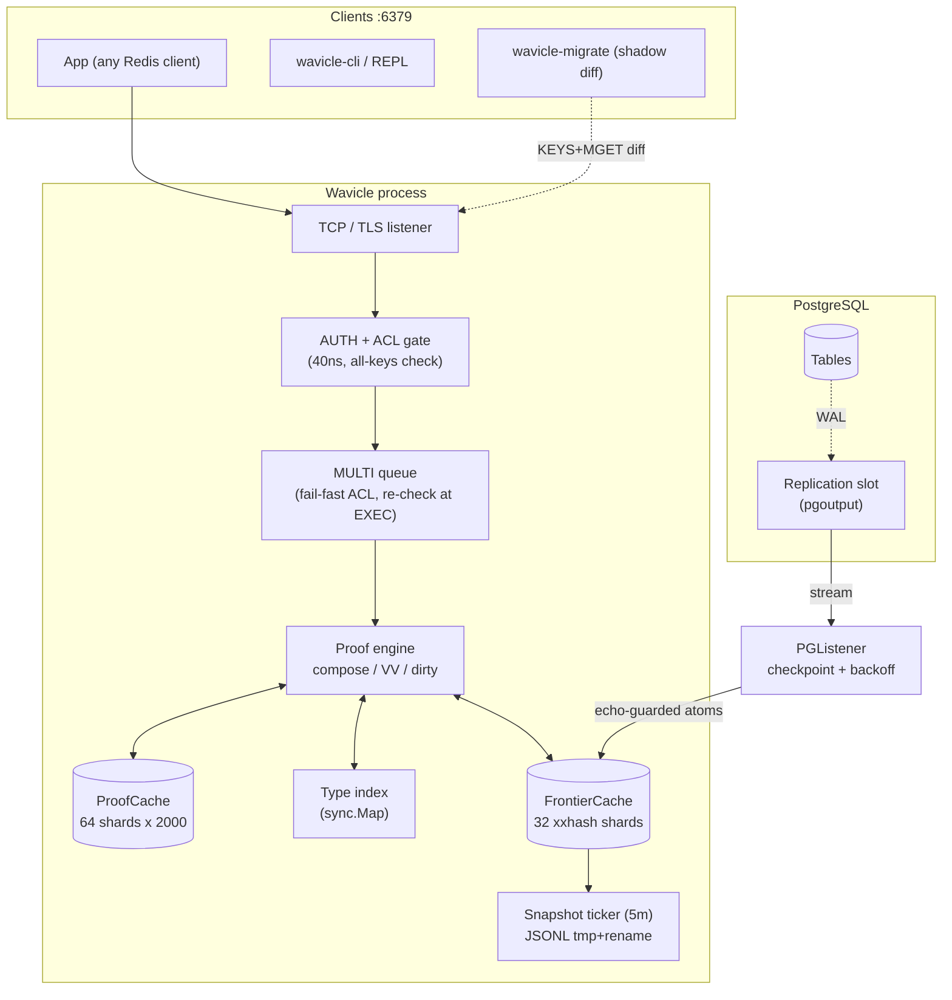
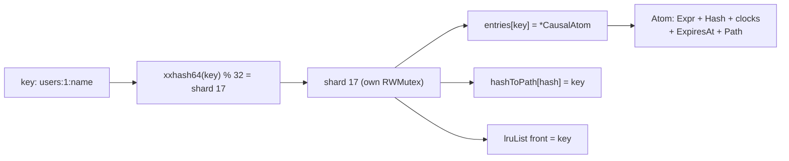
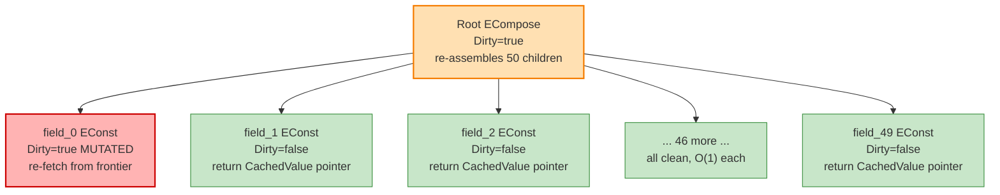
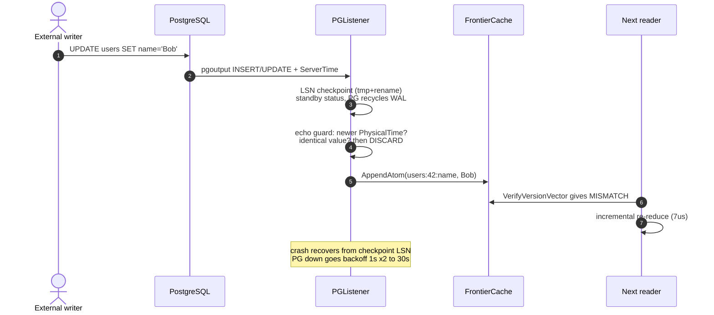
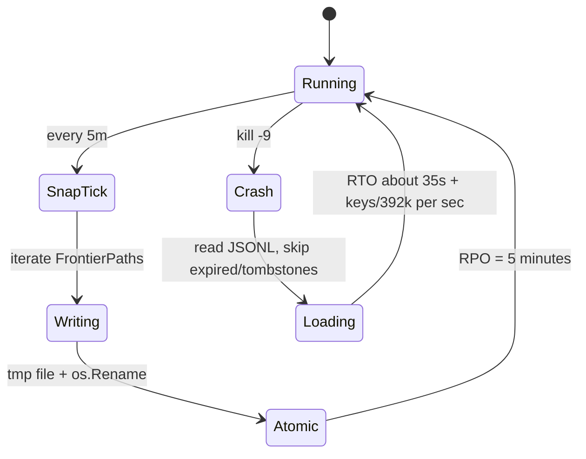
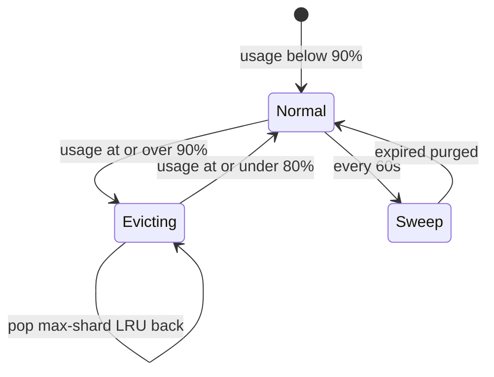
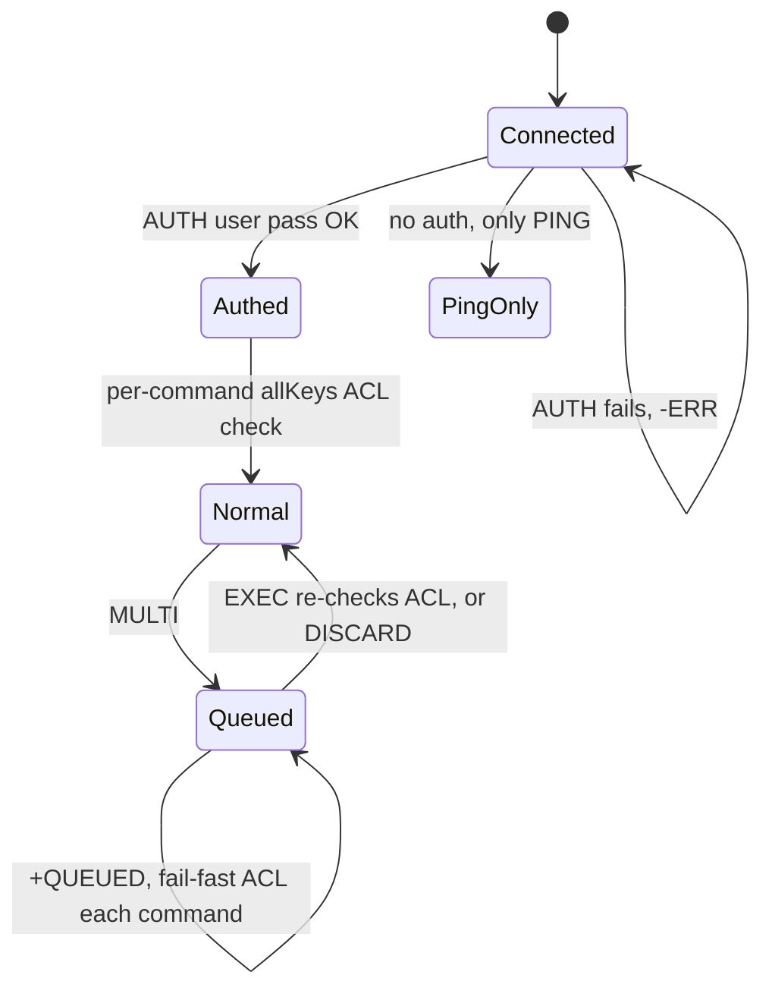
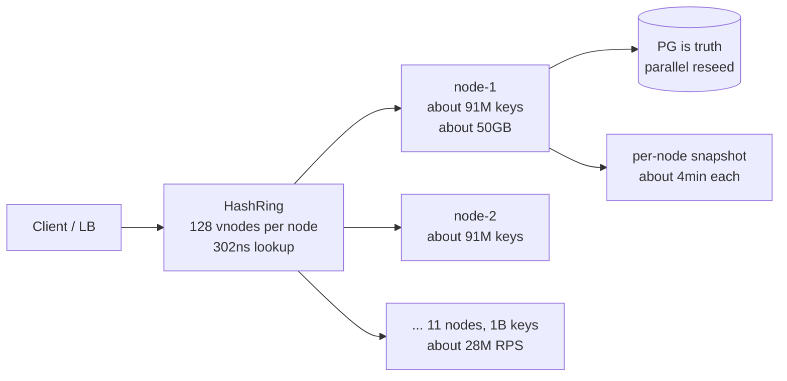

# The Big Brother Interview Playbook: Wavicle, soup to nuts

> Read me like I'm sitting next to you the night before the loop. I assume you know
> NOTHING — every idea starts from zero, then goes deep enough to survive Staff+.
> Every number has the command that produced it. Every snippet is copy-pasted from
> the repo (`internal/...`), not invented. If they ask anything about this project,
> the answer is in here.
>
> **How to drill (don't memorize 600 lines):** MEMORIZE Part 0 (hook + numbers +
> whiteboard). DERIVE Part 4 on paper once (the math is all division). KNOW the top 8
> answers: hook, reinvented-invalidation (§0.1), CDC lag honesty (Q11), lock story (Q3),
> TOCTOU + wrongType war stories, stale-window math, what breaks at 1B. SKIM the rest —
> it's indexed so you can find any answer in 10 seconds.
>
> **Giving this doc to an AI?** Start it at §0.2 (context capsule) — dense project
> state in one page — then point it at the part you need.

---

## §0.1 The question you'll definitely get: "so you just reinvented invalidation?"

Yes — and that's the honest pitch. Invalidation isn't gone; it MOVED. Before: N hand-written
write paths (`cache.del()` in every service, migration scripts nobody updates, DBA consoles) —
miss one and users read stale forever. After: ONE stream (Postgres WAL via `pgoutput`, same
`ChangeEvent` shape for MySQL) that catches EVERY writer, including raw migrations nobody told
you about. N fragile call sites → 1 durable stream + a read-time hash check. Say exactly that.

## §0.2 Context capsule (for AI assistants and 2-minute briefings)

Wavicle = proof-verified cache in Go, RESP3 on :6379. Every cached value carries a version
vector (`path → SHA3 hash`); every read re-checks it against the LOCAL frontier (32-shard
in-RAM map fed by write-through + PG/MySQL CDC). Match → 1.7µs return. 1-of-50 changed →
dirty-propagation re-reduce, 7µs. PG is the source of truth; `CausalCrystal` (WAL DAG) is
dev-only. Status: single-node pilot-ready (TLS+ACL wired with fail-fast boot, slot watchdog,
5m snapshots, 13-check pilot list); NOT quorum-replicated, longest soak 2 min, MySQL = poller.
Defaults: binary fail-open; pilot config fail-closed (PG: slot-health oracle armed automatically
with the watchdog — idle serves at lag ~0, proven-behind-or-blind fails; MySQL: `max_staleness`
poll-health bound; dev: always open).
Numbers: in-process (add 200–500µs network, 25–80ms CDC over VPC). Open gaps: Raft, binlog GA,
7-day soak, RBAC/SSO. Entry points: `main.go`, `engine/incremental.go:ReduceIncremental`,
`storage/sharded_frontier.go`, `protocol/resp3/server.go`, `replication/postgres.go`.

---

# PART 0 — YOUR 60-SECOND HOOK (memorize this)

When they say *"tell me about a complex project"* — do NOT hype. Say this:

> "I built **Wavicle**, a cache-consistency engine in Go. Normal stacks guess TTLs or
> hand-write `cache.del()` on every write path — miss one path or run one raw migration
> and users read stale data. Wavicle flips it: every cached value carries a **receipt**
> (a version vector: `path → hash` of each dependency). On EVERY read it re-checks the
> receipt against the local frontier — the in-RAM mirror kept current by write-through
> plus a Postgres change stream. Nothing changed → return in **1.7µs, zero allocations**.
> One field of 50 changed → re-evaluate only that subtree in **7µs** — 7.9x faster than
> recomputing everything, proven with `benchstat`. It speaks Redis's RESP3 protocol and
> stays behind Postgres as the source of truth."

Then shut up. Let them pull the thread. This doc is every thread they can pull.
One rule: every latency you quote gets "(in-process — plus 200–500µs network and 25–80ms
CDC over a real VPC)" appended BY YOU, before they ask. Q17 exists for when they ask anyway.

## Numbers to know cold (all measured on i5-1240P, Go 1.25 — say the machine)

| Number | Meaning | Command |
|---|---|---|
| 90ns | single-key hot read, 0 alloc | `go test -bench=BenchmarkWarmRead_Wavicle ./benchmarks/` |
| 1.7µs | 50-field warm reuse, 0 alloc | `BenchmarkProofReduction_WarmReuse_FastPath1` |
| 7µs | 50-field, 1 changed, 5 allocs | `BenchmarkProofReduction_Incremental_Revolutionary` |
| 55µs | cold compose, 213 allocs | `BenchmarkProofReduction_Cold` |
| 32.6x / 7.9x | warm / incremental speedup vs cold | 55/1.7, 55/7 |
| 44M ops, 0 errors | 2-min soak, 4W+16R, 1k keys | `go test -tags=soak -run Soak ./benchmarks/` |
| 2.16x | 32-shard vs 1-mutex under 16-way load (1021ns → 473ns) | `BenchmarkGoat_ShardedVsSingle_Parallel` |
| 3.8µs | INCR on production backend | `BenchmarkGoat_ExtendedCmds` |
| 1–3.5ms | same op on dev backend (WAL fsync tax, 250–500x) | same bench vs Crystal |
| 40ns | ACL check (2% of hot path) | `BenchmarkGoat_ACLAuthorize` |
| 392k keys/s | snapshot save rate | `BenchmarkGoat_Snapshot` |
| 3.42µs/key, 550B/key | write cost, RSS plan value | `BenchmarkBillion_Write100k` |

## Whiteboard diagram (draw this)

```
READ:  Client → ProofCache (SHA3 lookup)
         hit → VerifyVersionVector (all hashes match? → return, 1.7µs)
                mismatch → FindChangedPaths → PropagateDirtyUp → reduceDirty (7µs)
         miss → ComposeProof (55µs) → store → return
WRITE: Client → FrontierCache map replace (new hash) → PG write-through
       external DB write → PG WAL → pgoutput → listener → FrontierCache
       next READ sees hash mismatch → incremental re-reduce. No DEL anywhere.
```

---

# PART 1 — FOUNDATIONS FROM ZERO (the big-brother part)

## 1.1 What is a hash? Why two of them?
A hash turns any data into a fixed fingerprint. Same data → same fingerprint. Different data →
different fingerprint (with overwhelming probability). Wavicle uses **two** because one tool can't
do both jobs:
- **SHA3-256** (slow, ~hundreds of ns, cryptographic): for atoms stored/replicated. If two atoms
  ever share a fingerprint, the cache would confuse them — needs crypto strength. (`core.Hash`,
  `CausalAtom.ComputeHash` in `internal/core/types.go`.)
- **xxHash64** (~10 GB/s, NOT cryptographic): for the in-memory hot path — cache-shard picking
  (`shardFor`), AST dedup, Merkle math. Collisions here just cost a retry, never correctness.
  That's how warm reads stay at 0 allocations.

## 1.2 What is a mutex? Why sharding?
A mutex is a lock: only one goroutine inside at a time. `sync.RWMutex` lets many *readers* in
together but a *writer* blocks everyone. One mutex around one big map = under 16 writers everyone
queues. **Sharding** = 32 small maps each with its own lock (`ShardedFrontierCache`, 32
`frontierShard`s; key → shard by `xxhash % 32`). Two keys on different shards never contend.
Measured: 1021ns → 473ns under parallel load. Same trick in `ProofCache` (64 shards) and the
AST `InternTable` (256 shards).

## 1.3 What is a WAL? Why did we DELETE ours from production?
Write-Ahead Log: before acknowledging a write, append it to a file + `fsync` (force to disk).
Survives crashes, costs ~0.1–0.3ms per write. The old backend (`CausalCrystal`) had one — and
measured 1–3.5ms per op vs 3.8µs without it. Since **Postgres already durably stores everything**,
a second WAL in the cache bought crash-safety we already had, at 250–500x cost. Deleted from the
hot path; Crystal kept for dev/validation only. Say this sentence in interviews.

## 1.4 What is a Merkle tree, in one breath?
Hashes of hashes: leaf hashes roll up into one root hash. Equal roots = equal datasets (O(1)
compare instead of O(n) scan). Wavicle keeps a per-proof Merkle root (`ProofNode.ComputeMerkleRoot`,
cached with `MerkleValid` flag) so "did anything in this subtree change?" is one 32-byte compare.

## 1.5 LRU in one breath
Least-Recently-Used: keep a linked list, touch a key → move to front, pressure → evict from back.
Wavicle: ceiling `WAVICLE_MAX_MEMORY` (default 4GB), evict at 90% down to 80% (draining to 80 avoids
evicting on literally every write — "ping-ponging"). Evicted keys aren't lost: PG read-through
re-seeds them (`WriteThroughStore.GetCurrent` fallback).

## 1.6 RESP3 / TCP in one breath
Redis's wire protocol over TCP (`:6379`): commands as arrays of bulk strings (`*2 $3 GET $5 mykey`).
Wavicle parses both real RESP arrays and plain `SET a b` text (`readCommand` in
`internal/protocol/resp3/server.go`). Any Redis client can connect; only supported commands work.

## 1.7 CDC / logical replication in one breath
Postgres can stream every committed row change (its WAL) to a subscriber via the `pgoutput`
plugin. Wavicle's `PGListener` (`internal/replication/postgres.go`) subscribes, decodes tuples,
maps rows → cache paths (`users:42` + column → `users:42:name`), and folds them into the frontier.
External writes (DBA, migrations) arrive 25–80ms later over a real VPC — still 1200x fresher than
a 60s TTL. MySQL has the same shape via the polling `MySQLListener` (`replication/mysql.go`).

## 1.8 CAP in one breath (they WILL ask)
You get 2 of 3: Consistency / Availability / Partition-tolerance. Wavicle's honest position:
**AP by default, CP where armed.** Unconfigured reads are fail-OPEN: if CDC stalls, the frontier
silently ages and matching vectors still return — that's availability-first behavior, and any
doc revision claiming otherwise was wrong. The fix that makes CP real: health-oracle fail-closed
reads — PG fails reads only when the slot PROVES behind-or-blind (lag ≥ page bytes, inactive,
missing), MySQL only when its poller goes silent past `max_staleness`. Idle-but-healthy always
serves (lag ≈ 0, clean polls) — event-recency oracles that fail quiet streams were considered
and rejected for exactly this reason. So: "AP out of the box, CP in pilot config, and I can show
you both — including the test where a healthy-but-quiet stream serves." Single node ≈ 99.5%
(≈3.65h/mo down). 3-node quorum math (Raft, not yet built): loss needs 2
of 3 down simultaneously: `3(0.005²)(0.995) + 0.005³ ≈ 7.46e-5` → 99.9925% (~39 min/yr).
Never claim quorum numbers as shipped — the math is provisioned, code is hashring routing only.

---

# PART 2 — EVERY FILE, WHAT IT DOES (the creator's map)

```
main.go                              entry: picks backend, starts CDC, RESP3, metrics, snapshots
internal/core/types.go               Hash, Value types, CombinatorExpr algebra, CausalAtom
internal/core/intern.go              256-shard AST dedup (structural sharing, less GC)
internal/engine/proof.go             VersionVector, ProofNode (dirty flags, Merkle), MaterializedProof
internal/engine/compose.go           ComposeProof: first-read full build
internal/engine/incremental.go       ReduceIncremental: FP1 → dirty propagation → re-reduce
internal/engine/cache.go             ProofCache: 64-shard LRU (queryHash → proof)
internal/engine/sqlparser.go         SELECT cols FROM tbl WHERE id=X → proof tree (prototype!)
internal/storage/adapter.go          Store interface + WriteThroughStore (PG first, local second, PG fallback)
internal/storage/frontier_cache.go   ORIGINAL single-mutex backend (kept for compat/benchmarks)
internal/storage/sharded_frontier.go PRODUCTION backend: 32 shards, LRU, TTL sweep, snapshot v2
internal/storage/crystal.go          DEV backend: full DAG + WAL (algorithm validation only)
internal/storage/postgres.go         PG UPSERT/SELECT (table:id:column ONLY — rigid by design)
internal/protocol/resp3/server.go    TCP+RESP3, AUTH/ACL, MULTI/EXEC, core KV/Hash, type index
internal/protocol/resp3/extended.go  Redis-7 subset: counters/lists/sets/zsets/streams/hashes/generic
internal/auth/acl.go                 users, SHA256 passwords, command+key allowlists
internal/replication/adapter.go      ChangeEvent/ChangeListener/PathMapper (${col} templates)
internal/replication/postgres.go     pglogrepl consumer: LSN checkpoints, backoff, echo guard
internal/replication/mysql.go        polling high-watermark CDC (binlog tail = future work)
internal/cluster/hashring.go         128-vnode consistent-hash routing (sharding, NOT replication)
internal/config/config.go            all knobs + WAVICLE_* env (TLS/ACL/snapshot/cluster/MySQL)
internal/telemetry/metrics.go        Prometheus: hits, latency, lag, memory, slots
cmd/wavicle-cli/main.go              CLI + REPL
cmd/wavicle-migrate/main.go          shadow prover: diffs source vs target key-by-key, exit 2 on drift
configs/wavicle.yaml                 production config template
benchmarks/                          proof benches, goat benches, billion probe, soak/load
docc/GOAT_PROOF.md                   measured numbers + failover math (cite this, not README badges)
docc/PILOT_CHECKLIST.md              13-check staging sign-off
docc/MAKING_HISTORY.md               101-commit story: Crystal → cache pivot with hashes
```

---

# PART 3 — HOW A READ / WRITE ACTUALLY FLOWS (trace it like a debugger)

## READ `GET users:1:name` (warm — the common case)
1. `handleConnection` reads args → ACL check (`Authorize(user, "GET", "users:1:name")`, ~40ns).
2. `HandleCommand` → `store.GetCurrent` (shard lock, LRU touch, expiry check).
3. `proofCache.Get(queryHash)` where `queryHash = SHA3(path + mode)`.
4. `ReduceIncremental` (`incremental.go:27`): `VerifyVersionVector` — for EACH path in
   `proof.VersionVector.Entries`, compare stored hash vs frontier hash. All match → bump
   `AccessCount`, return `proof.Value`. 50 entries × ~30ns map lookups ≈ 1.5µs. Zero allocations
   (pre-sized structs, stack buffer `[64]string` for diffs).
5. Reply formatted (`formatBulkString`), latency recorded to Prometheus.

## READ with 1 changed field (incremental)
4'. One hash mismatches → `FindChangedPaths` returns `["...:field_5"]` → `ResetDirty()` then
`PathToNode["...field_5"].PropagateDirtyUp()` (marks leaf + ancestors only) → `reduceDirty(root)`:
clean children return `CachedValue` pointer (O(1)), dirty leaf re-fetches current atom, root
re-assembles → version vector updated in place, Merkle recomputed. 49/50 cache hits, ~7µs.

## WRITE `SET users:1:name Bob`
1. `HandleCommand` → `assertKeyType(path,"string")` (index first, shape second) → `store.AppendAtom`
   → `WriteThroughStore`: PG UPSERT first, then local shard replace (old hash dropped, new
   `ComputeHash()` = SHA3(expr + clocks + nonce + parents)). `setKeyType(path,"string")`.
2. NOTHING is invalidated. The next read's VV check fails on the new hash and re-reduces. That's
   the whole trick — invalidation is a *read-time comparison*, not a write-time chore.

## EXTERNAL write (DBA updates PG directly)
PG WAL → `pgoutput` → `PGListener.handleCopyData` → tuple decode → `mapRow` → `ChangeEvent`
→ `runCDCApplier` (echo guard: skip if `PhysicalTime` newer or value identical) → `local.AppendAtom`.
Proof cache untouched; next read detects it. Crash-safe: LSN checkpoints to disk
(`replication_checkpoint.lsn`), resume from exact offset, exponential backoff 1s→30s.

---

# PART 4 — MATH, WORKED (never say a number without the derivation)

## 4.1 Why is warm reuse 1.7µs? (do this on the whiteboard)
50-field composite: FastPath1 = 50 iterations of (map lookup + 32-byte compare).
Go map lookup ~30ns → 50 × 30ns = 1.5µs + function overhead ≈ 1.7µs. Single key: 1 lookup +
1 compare ≈ 90ns. Versus: Redis network hop 200–500µs, PG query 2–5ms. The freshness check costs
~1% of even the fastest network alternative.

## 4.2 Complexity bounds (and what the letters mean)
- FP1: O(m), m = dependencies in the vector.
- Incremental: O(k·log d) — dirty flags walk k changed leaves up d-deep parent chains; clean
  subtrees return cached pointers without visiting children.
- Cold compose: O(n), n = proof nodes. Worst-case incremental degrades to O(n) (everything
  changed) — say this; it proves you know the bound isn't magic.

## 4.3 Availability (show the formulas)
- Single node: A=99.5% → downtime/mo = 0.005 × 730h = **3.65h**.
- 3-node ring (routing only, shipped): P(any 1 down/mo) = 1 − 0.995³ ≈ **1.49%**; impact = ⅓ keyspace.
- 3-node quorum (Raft, NOT shipped): P(≥2 down) ≈ 7.46e-5 → **99.9925%, ~39 min/yr**.

## 4.4 RPO/RTO with snapshots (measured save rate 392k keys/s)
RPO = snapshot interval (5m default). RTO ≈ 30s detect + 5s start + keys/392k.
100k keys → ~36s. 1M → ~38s. 1B single-stream → 42.5min (hence: snapshot per node in parallel).

## 4.5 WAL-bloat death math (the PG risk you must recite)
Growth = write_rate × avg_wal_bytes. 4000 writes/s × 500B ≈ 2MB/s = **7.2GB/h**.
100GB disk → full in **13.9h** of dead consumer. Thresholds: alert lag > 1GB, page > 10GB
(`QuerySlotInfo` exposes `lag_bytes`; metric `wavicle_replication_slot_bytes`).

## 4.6 Billion keys (measured units → extrapolated totals)
Units: write 3.42µs/key, GET 351ns/op (~2.85M/s/node), 550B/key RSS.
1B keys → 550GB + imbalance + ceiling headroom ≈ **650GB → 11×64GB or 5×128GB nodes**;
load ~57min on 1 node, ~6min on 10; cluster ~28.5M RPS. Node loss on ring-alone = 91M cold keys
≈ 50h single-thread PG reseed → parallel reseed or quorum replica required. Bottom line you say:
*"fits on 11 boxes, but don't run 1B on ring-alone."*

## 4.7 Stale-window reduction
Redis TTL 60s vs Wavicle CDC lag ~50ms p99: 60/0.05 = **1200x smaller window**. At 10k RPS with 1%
external-write keys: ~8.64M stale-prone reads/day → ~7,200/day. Three orders down, not zero.

## 4.8 Sharding imbalance (measured)
30k keys, 3 nodes, 128 vnodes: 9956/9448/10596 → max−min = **3.83%**. Provision hottest +5%.

---

# PART 5 — SNIPPETS YOU MUST WRITE FROM MEMORY (all real, from the repo)

**1. The hot path** (`storage/sharded_frontier.go` shape; original in `frontier_cache.go`):
```go
func (f *FrontierCache) VerifyVersionVector(entries map[string]core.Hash) bool {
    f.mu.RLock()
    defer f.mu.RUnlock()
    for path, expectedHash := range entries {
        atom, ok := f.entries[path]
        if !ok || atom.Hash != expectedHash { return false }
        if !atom.ExpiresAt.IsZero() && atom.ExpiresAt.Before(now) { return false }
    }
    return true
}
```
Say: "a hash match IS a content match (SHA3), so matching fingerprints mean the cached value
is fresh *relative to the frontier* — the in-RAM mirror of the database, not Postgres itself.
Freshness against Postgres is bounded by CDC lag, and the stale guard turns 'bounded' into
'refused' when the oracle fires."

**2. Dirty propagation** (`engine/proof.go:47`):
```go
func (n *ProofNode) PropagateDirtyUp() {
    if n.Dirty { return }
    n.Dirty = true
    n.MerkleValid = false
    if n.Parent != nil { n.Parent.PropagateDirtyUp() }
}
```

**3. The skip that makes it fast** (`engine/incremental.go`, `reduceDirty`):
```go
if !node.Dirty && node.CachedValue != nil {
    proof.ReduceStats.CacheHits++
    return node.CachedValue, nil  // O(1), zero work
}
```

**4. The 3-path dispatcher** (`ReduceIncremental`): VV match → return; else `FindChangedPaths`
into stack `var changedBuf [64]string` (zero-alloc) → `ResetDirty` → propagate → `reduceDirty` →
update vector in place → recompute Merkle. Say "three levels, fastest first."

**5. Auth gate** (`auth/acl.go`): SHA256-hashed passwords, `subtle.ConstantTimeCompare`
(timing-attack safe), per-user command allowlist + key-prefix globs, `Admin` bypass.
Measured cost 40ns — quote it when they ask "doesn't auth kill your 90ns?"

**6. Snapshot contract** (`SaveSnapshot`/`LoadSnapshot`): JSON-lines + `os.Rename` tmp→final
(crash-atomic), v2 kinds `string|int|float|bool|bytes|list|set|zset`, tombstones skipped,
expired skipped. RPO = interval.

---

# PART 6 — THE QUESTION BANK (by interviewer species, with follow-ups)

## A. Systems / backend (Go)
**Q1. "Why not Redis + 30s TTL?"**
TTL is a heuristic: 1s → stampedes PG; 60s → minute of stale payments/inventory. Wavicle caches
indefinitely but verifies in 1.7µs — no compromise. *Follow-up: "CDC lag means still stale 50ms!"*
→ "Yes — 1200x smaller window, disclosed, not zero. TTL's window is a choice; ours is physics."
**Q2. "Why not Debezium+Kafka invalidation?"**
Works, but: Kafka ops-burden for key eviction + coarse busting (1 field changes → whole key
recomputed over TCP). Wavicle re-reduces one subtree in-process. *Follow-up: "So you reimplemented
CDC?"* → "No — we consume pgoutput directly, no broker, same ChangeEvent shape MySQL reuses."
**Q3. "Single RWMutex at 50k QPS?"**
Was the bottleneck (measured 1021ns contested). Two fixes, both measured. First: 32 xxhash
shards + 64-shard proof cache — different keys never share a lock (2.16x under parallel load).
Second: SHA3 minting moved BEFORE the shard lock, so writers queue only for the map assign
(~15ns), not the hash. Out-of-order danger (older issue grabbing the lock second) is closed by
a clock guard: resident atom with a higher `LogicalClock` wins, stale issue discarded
(`storage/sharded_frontier.go:AppendAtom`, tested by `ConcurrentSameKey`).
*Follow-up: "Writer starvation?"* → short sections + per-shard locks; future: RCU/epoch.
**Q4. "Why keep SKI combinators? Overengineering?"**
Practical, not academic: interned immutable AST = hashable, serializable, walkable dependency
graph. Closures/reflection give none of that. Dirty propagation = parent-pointer walk.
*Follow-up: "Cost?"* → interning (256 shards, monotonic IDs) + 3-tier hashing (xxHash hot,
SHA3 stored).
**Q5. "Go GC at 2.8M ops/s?"**
Hot path is 0-alloc by construction (stack buffers, cached values, no per-read marshal).
Benchmarks assert it (`0 B/op`). Prometheus histogram observe is the known alloc hotspot left.
**Q6. "What happens at OOM?"**
`WAVICLE_MAX_MEMORY`, 90%→80% LRU, byte-accounted; evicted keys re-seed from PG. Never fatal.

## B. Database internals
**Q7. "Replication slot fills disk — your cache PG-outages production?"**
Yes, if unwatched — the scariest real risk. Math: 7.2GB/h at 4k w/s; 100GB in 13.9h. Defenses:
continuous LSN flush (recycles WAL), disk checkpoint resume, `lag_bytes` alerts at 1GB/10GB,
runbook slot-drop. *Follow-up: "Consumer down 24h?"* → drop slot, snapshot+reseed; say it.
**Q8. "Echo suppression — why compare values AND timestamps?"**
Write-through PG echo returns seconds later over CDC; naive re-append mints a new hash (clock in
hash!) and pointlessly invalidates proofs. Guard: skip if `PhysicalTime` newer or value identical.
**Q8b. "Write-through does PG-then-local. Process dies between them?"**
Then PG has a write the cache never saw — the exact hole CDC was built for: on restart the
listener resumes from its LSN checkpoint and replays the missed event (echo guard lets it
through because nothing local is newer). Three nets, in order: (1) CDC replay from checkpoint,
(2) `WriteThroughStore.GetCurrent` PG fallback seeds the cache on next miss, (3) the 30s
revalidation net (`adapter.go`) catches anything both missed. No net is trusted alone.
**Q8c. "PG says A, frontier says B on the same key — who wins?"**
Decided, not fixed: whoever arrived last wins the frontier (both paths append; higher clock or
later arrival stands), and divergence heals toward PG — the 30s revalidation net compares and
reseeds from PG, and CDC replay ordering converges concurrent cross-writer generations. What is
NOT promised: per-key monotonicity across the DB boundary (the PG consistency test asserts
validity + bounded visibility + convergence, explicitly not cross-boundary monotonicity —
see its header). In-process, monotonic reads DO hold (checker proves it).
**Q9. "SQL parser is a toy. Admit it."**
Happily: only `SELECT cols FROM tbl WHERE id=X`, keys must be `table:id:column`. Joins need a real
planner (Vitess-style). Claiming more is the fastest way to fail the loop.
**Q10. "Why store sets/zsets as VRecord — ambiguous with hashes?"**
Was a real bug (SADD merged into ZSETs). Fixed with the `keyTypes` index (Redis-robj equivalent):
index authoritative on write, shape re-verified on read. Empty-record ambiguity documented.

## C. Distributed systems
**Q11. "CAP? What do you sacrifice?"** → §1.8: AP by default (fail-open reads), CP where
armed — PG via slot-health oracle, MySQL via poll-health bound (`TestStaleGuard_PGSlotHealth`,
`TestStaleGuard_MySQLPollHealth`, chaos stall drill). If CDC stalls unguarded, vectors still
match a stale frontier — say this BEFORE they trap you. Quorum math is provisioned, not shipped.
**Q12. "Hashring isn't replication. What dies with a node?"** → 1/N keyspace until reseed;
at 1B scale that's a 50h incident without parallel reseed — hence quorum is next, hashring is
sharding-only. Say both halves.
**Q13. "Clock in the hash breaks determinism across replicas?"** → Hashes are per-node content
addresses, not cross-node consensus tokens. Cross-node agreement (future Raft) compares VALUES
+ versions, never raw hashes. Good catch answer.
**Q14. "Linearizability?"** → Single-key read-your-write within a node (write updates frontier
synchronously) + per-key monotonic reads in-process (checker-proven). Cross-node/external-write:
bounded staleness = CDC lag, UNLESS the health oracle fires — then overdue reads error instead of
serving, which is fail-closed consistency, not linearizability. Don't claim linearizability
globally; claim the exact contract.

## D. Performance / benchmarking (where juniors die)
**Q15. "Prove 7.9x isn't noise."** → `testing.B -count=6` + `benchstat`, p=0.002 on the
Crystal→Frontier 34.4% win; report medians ±%. Single runs mean nothing (thermal throttling).
**Q16. "Timer skew trap?"** → Never `StopTimer/StartTimer` in the loop (each is a 1–2µs syscall
on Windows). Reset dirty state inline instead.
**Q17. "Your 90ns is in-process; Redis is network. Apples?"** → Correct — end-to-end over VPC both
pay 200–500µs RTT; Wavicle's win is *skipping PG work* (2–5ms → µs), not skipping physics. Say it
before they do.
**Q18. "Why is INCR 3.8µs but GET 90ns?"** → GET hits FP1 (hash compares only). INCR pays
SHA3 mint + interning + Prometheus observe. Different paths, both measured on the SAME backend —
and Crystal's 1–3.5ms shows what fsync costs.

## E. Security / production
**Q19. "Threat model?"** → TLS termination, per-user ACL (commands + key prefixes), constant-time
password compare, identifier validation on table/column (SQL injection), multi-key commands check
ALL keys (MSET leak fixed), TX re-checks ACL at EXEC (bypass fixed). Missing: RBAC/SSO, audit log,
at-rest KMS — say so.
**Q20. "Worst outage you could cause?"** → Slot-bloat PG disk-full (Q7) or cold-restart thundering
herd (1M keys × 2ms PG reseed = 33min; snapshot cuts to seconds — RTO drill is checklist #13).

## F. Behavioral / startup (founder lens)
**Q21. "Why will anyone switch from Redis?"** → They won't fleet-wide. Wedge: ONE PG-heavy,
read-heavy service as sidecar, shadow-migrated (`wavicle-migrate` exit 0), then expand. Sell
"zero-stale for PG," not "faster Redis."
**Q22. "What did you kill?"** → Own WAL in prod, fake benchmark, FastPath2 (broken), full-history
memory, "AI resonance" positioning. Killing is the story of §4 in MAKING_HISTORY.
**Q23. "Design-partner pitch, 30 seconds?"** → "Give me staging + one read-heavy endpoint. I run
the 13-check pilot; you watch lag/hit-rate dashboards for a week. Rollback = point DNS back."
**Q24. "Why you?"** → "Solo-built engine+protocol+CDC+benches; found 18 bugs by re-testing my own
code and fixed each with a regression test — including two my own consistency checker caught in
my own harness, and one my own shadow runner caught live. The repo shows the work, not claims."
**Q25. "How is this different from ReadySet / mcrouter-style MySQL caches / RDI?"**
Honest answer, three parts: (1) same CDC-stream insight — everyone converged on 'watch the
database log instead of hand-invalidating'; no novelty claimed there. (2) What differs is
read-time verification: cached values carry dependency hashes re-checked per read, plus
incremental subtree re-reduce instead of whole-result recompute. (3) What I have NOT done:
run them head-to-head — no benchmark against ReadySet exists in this repo, so I won't claim
a speedup over them, only over cold recompute and TTL staleness windows. Say that verbatim.

---

# PART 7 — WAR STORIES (they trust scars, not medals)

| # | Symptom | Root cause | Fix + test |
|---|---|---|---|
| 1 | Sweeper deleted keys under readers (race detector) | RLock held during delete | collect under RLock → re-verify under Lock; return atom copies |
| 2 | WRONGTYPE sent empty reply, clients hung | `wrongType()` returned `("",err)`, callers discarded err | return RESP `-ERR` as the string; `wrongTypeResp` const |
| 3 | `KEYS` showed `profile:1:theme` | internal `key:field` paths leaked | collapse via type index + direct-key set |
| 4 | SADD merged into ZSET silently | shared VRecord storage | `keyTypes` index + shape re-verify |
| 5 | `RPOP k 2` returned `c,d` not `d,c` | forgot pop-order reversal | reverse tail; regression test |
| 6 | `XRANGE` ignored min/max | args parsed, never applied (+ lexicographic trap) | numeric `parseStreamID` compare |
| 7 | Snapshot lost lists/sets/zsets | v1 only snapshotted scalars | v2 kinds + `SnapshotComplexTypes` test |
| 8 | `EXEC` bypassed ACL; `MSET` checked 1 key | auth at wrong layer | `allKeys()` at queue AND exec time |
| 9 | New cache leaked a goroutine per construction | `NewShardedFrontierCache` built a throwaway `FrontierCache` for its env limit | parse env directly |
| 10 | MySQL table interpolated into SQL | config-trusted string in query | identifier allowlist like PG |
| 11 | Identical SET minted new hash, nuked dependent proofs | clock+time in hash; only CDC echo guard deduped | write-path `sameAtomContent` dedup (deadline-aware) + `SameValueDedup` test |
| 12 | Stalled CDC served confidently-stale reads (AP by default) | vectors match whatever the frontier holds | health-oracle fail-closed guard (slot lag/page, poll silence) — NOT event recency, which fails quiet streams |
| 13 | SHA3 inside shard lock held hundreds of ns per writer | conservative first version | hash-before-lock + `LogicalClock` guard (stale issue loses) + `ConcurrentSameKey` |
| 14 | Checker flagged ghosts that were never written | MY harness recorded history AFTER publishing (queue→apply→observe→record inversion) | record atomically with the append under one mutex; order == apply order == history order |
| 15 | Dev WAL replay took ~14s for 7.8MB, port dark | replay cost never measured; old "<2s per 1M atoms" claim untested | measured, claim killed, wrote it into the credibility doc as a false-claim example |
| 16 | Dev-mode SETs cost ~58ms under load | per-write file Sync on Windows + growing WAL | documented as dev-only evidence FOR the no-WAL production design (prod: ~3µs) |
| 17 | Lag metric labeled by table, unbounded | fresh `WithLabelValues` per table = series explosion | cap 64 + `_other` overflow; `LabelCardinalityBounded` test with 200 tables |
| 18 | Shadow runner compared 1 phantom key, not 200 | KEYS collapse heuristic merged `shadow:N` into parent "shadow" | collapse ONLY on explicit type-index `hash` (`isHashKey`); `FlatColonKeysIntact` test; inference documented as unfixable |

Tell 2–3 max in the room. Each ends with the test name — that's what makes it credible.

---

# PART 8 — DO-NOT-SAY TABLE (expanded)

| ❌ | ✅ | Why |
|---|---|---|
| "Drop-in Redis replacement" | "RESP3 for KV/Hash/List/Set/ZSet/Stream; no Lua/Cluster" | Stream support ≠ ecosystem parity |
| "Any SQL cached" | "Prototype: `SELECT cols FROM t WHERE id=X` only" | Joins need a planner |
| "11.7ms CDC in production" | "12ms loopback; 25–80ms VPC p99" | Seniors reject loopback quotes |
| "Zero stale reads, ever" | "Zero stale within a node; bounded by CDC lag across DB boundary" | Physics |
| "Proved O(k log d)" | "Dirty flags walk k leaves up d depth; measured 7µs vs 55µs" | Theory vs measurement |
| "44M ops on laptop = prod" | "44M-op soak methodology; rerun on YOUR hardware (checklist #8)" | Hardware honesty |
| "Quorum availability 99.99%" | "Quorum MATH 99.9925%; shipped: ring routing only" | Don't sell the roadmap |
| "Memory never runs out" | "4GB ceiling, 90→80 LRU, PG read-through" | OOM kills careers |

---

# PART 9 — CURRENT STATUS + FUTURE GOALS (no fabrication zone)

> Read this when they ask "where is it now / what's next." Everything here names code or docs.

**Shipped and green (`go test ./...` all ok):** proof engine (VV + dirty-propagation + 64-shard
proof cache), 32-shard frontier with LRU/TTL/snapshot-v2/5m ticker, Redis-7 subset
(List/Set/ZSet/Stream/counters/MULTI) with type index, multi-user ACL file + TLS termination
(both fail-fast wired in `main.go` — verified live: bad file/cert = exit 1), PG CDC with LSN
checkpoints + slot watchdog (WARN 1GB / PAGE 10GB, never auto-drops), MySQL poller, shadow-migrate
prover (one-shot + `--continuous` shadow mode with 50ms deadlines, JSONL + report),
`wavicle-bench` (p50/p99 vs any RESP target) + `wavicle-cdcbench` (real visibility CSVs),
`/healthz` + `/readyz` (same oracles as the stale guard), govulncheck clean (x/text bumped),
13-check staging pilot; billion-key capacity model.
Longest soak: 2 minutes (+ live 30-minute shadow run in progress — report attaches to pitch on completion).

**Explicitly NOT done (say before they ask):** Raft quorum (math provisioned §4.3), true MySQL
binlog tail, 7-day soak + chaos drills, RBAC/SSO/audit log, rate limiting, SOC2, cloud-hardware
benchmarks (all numbers: i5 laptop). Seed money goes: quorum → binlog → soak/chaos → partner.

# PART 10 — CHEAT SHEETS

## 1-minute version (when the CTO walks in)
"Every cached value carries its dependencies' hashes. Every read re-checks them: match → 1.7µs
return; mismatch → re-fetch only what changed in 7µs. External DB writes arrive over Postgres
replication in tens of ms instead of a 60s TTL window. One binary, Redis protocol, Postgres stays
the truth. The proof is the test suite and the shadow-migrate diff, not my slides."

## Resume bullets (LaTeX, keep)
```latex
\item \textbf{Proof-based cache engine in Go} — version-vector freshness + incremental AST
reduction; \textbf{1.7$\mu$s} warm / \textbf{7$\mu$s} incremental vs 55$\mu$s cold
(\texttt{benchstat}, $p{=}0.002$); 44M-op soak; zero stale reads within a node,
staleness across the DB boundary bounded by CDC lag (opt-in fail-closed mode).
\item \textbf{Productionized}: 32-shard store, snapshot warm-restart, PG/MySQL CDC,
ACL/TLS, 13-check staging pilot; billion-key capacity model from measured unit costs.
```

## Live demo order (if they give you a terminal)
```bash
go build -o wavicle . && ./wavicle &
./wavicle-cli SET users:1:name Alice && ./wavicle-cli GET users:1:name
./wavicle-cli SET users:1:name Bob && ./wavicle-cli GET users:1:name   # no DEL. that's the talk.
go test ./internal/engine/ -run PoisonWrite -v
go test -bench=WarmReuse_FastPath1 -benchtime=2000x ./benchmarks/
```

Now close this doc. You know the system better than anyone who'll interview you — because you
can derive every answer from a hash comparison. Good luck, little brother. You've got this.

---

# PART 11 — UNDER-THE-HOOD ATLAS (every portion, visualized, no hand-waving)

> You asked: "lines, or the real machine?" This part is the machine. Each section = what
> the code LITERALLY does, then a diagram you can redraw. File:line pointers included.

## 11.1 The full machine (one diagram to rule them all)



## 11.2 Where a key lives (memory layout)

Key → shard is pure arithmetic, no lookup:



Under the hood, per portion:
- **Hash mint** (`core/types.go:ComputeHash`): `SHA3(expr.Serialize || LogicalClock || PhysicalTime || ExpiresAt || Nonce || BranchID || len(parents) || parents...)`. Clock/time inside the hash is why CHANGED writes always get a new fingerprint — and why UNCHANGED writes need the `sameAtomContent` dedup in `AppendAtom` (identical value + identical deadline returns the resident hash, zero proof invalidation). EXPIRE always mints (deadline is freshness).
- **Interning** (`core/intern.go`): `InternExpr` → `structuralHash` (xxHash over type-byte + value fast-hash or child monotonic IDs) → 256-shard bucket → on collision, append (both live, pointer identity decides). Headers come from a `sync.Pool`. Equal expressions share ONE pointer → parent-pointer dirty walks stay cheap, GC stays calm.
- **AppendAtom** (sharded): mint atom + `ComputeHash` BEFORE the shard lock (writers queue
  only for the map assign, ~15ns), then under lock: (1) clock guard — resident with higher
  `LogicalClock` wins, stale issue discarded; (2) same-value dedup — identical value + identical
  deadline returns the resident hash (no proof invalidation; EXPIRE still mints); (3) else replace
  (hash index + LRU + bytes) → unlock → global 90% check → evict.
- **Eviction**: over 90% → find max-bytes shard → pop its LRU back one at a time until 80%. One-at-a-time is O(evicted), each pop O(1).
- **TTL sweep**: every 60s, per-shard lock, delete expired (hash index + LRU + bytes), count into `TTLEvictionsTotal`. Evolution note: the ORIGINAL single-mutex sweeper collected under RLock then re-verified under Lock (the TOCTOU fix); sharded version holds one shard lock so no re-verify needed.
- **ProofCache** (`engine/cache.go`): 64 shards × 2000 entries = 128k proofs max. Shard = `FastHash` (first 8 hash bytes, little-endian) % 64. Trap detail: `Get` takes the FULL write `Lock`, not RLock — because LRU `MoveToFront` mutates. `Set` overwrites in place or evicts the back when `len >= capacity`.
- **Memory math** (`estimateAtomBytes`): 220 (struct+map+LRU) + `len(path)` + payload (`VString`: 16+len; `VBytes`: 24+len; other scalars: 16; composite expr: 48). Example: path 20B + 50B string → 220+20+66 = **306B accounted**; plan **~2x RSS** (Go map overhead) → 550–600B/key real.

## 11.3 The proof tree under the microscope (1 changed of 50)



Mechanics (`engine/compose.go`, `incremental.go`, `proof.go`):
- **Compose** (first read only): `gatherCausalClosure` (just the current atom — history deliberately NOT loaded) → `buildProofNode` RECURSES: leaf `EConst` = node; `ECompose` = resolve each child hash via `GetAtom` → recurse, fill `PathToNode[path] = node` index → `captureVersionVector` (frontier hashes, not historical) → `reduceDirty` once → store.
- **The index is the trick**: `PathToNode` maps EVERY path to its node, so `FindChangedPaths` output jumps O(1) to the exact dirty leaf instead of searching the tree. That's what makes it O(k log d) not O(n).
- **Merkle caching**: `ComputeMerkleRoot` returns cached root if `MerkleValid`; any dirty mark clears it up the chain. Next clean read re-arms it.
- **Locking**: each `MaterializedProof` has its own `mu` (`proof.go:120`) — concurrent GETs on DIFFERENT keys never touch each other; same-key concurrent reads serialize on that proof's lock (correctness over parallelism, per-key).

## 11.4 CDC pipeline (sequence, with the two guards that matter)



Under the hood (`replication/postgres.go`, `main.go:runCDCApplier`):
- Slot creation is IDEMPOTENT (exists-error ignored) — restarts never crash on setup.
- Every keepalive/timeout sends `WALWrite/Flush/Apply` = last LSN → PG advances `confirmed_flush_lsn` → WAL recycled. No flush = disk fills (7.2GB/h at 4k w/s — the §4.5 math).
- DELETE → tombstone atom (`VNull`), so `GET` returns nil and `EXISTS` returns 0 through the SAME version-vector path (no special case in the engine).
- MySQL (`replication/mysql.go`): same `ChangeEvent` shape; `SELECT * WHERE id > watermark ORDER BY id LIMIT 1000` per table per tick (default 500ms); table names allowlisted like PG.

## 11.5 Snapshot + memory-ceiling lifecycles (state machines)





Snapshot v2 line format (one JSON per line — `cat data/frontier.snapshot`):
`{"path":"users:1:name","value":"Alice","value_type":"string",...}` for scalars;
lists/sets/zsets use `"value_type":"list|set|zset"` + `"data":{...}` payload. Scalars, lists,
sets, zsets survive; tombstones and expired never persist (by design — they're deletions).

## 11.6 Connection lifecycle (auth → ACL → TX)



Under the hood (`server.go:handleConnection`):
- Parser accepts BOTH `*2...` arrays AND inline `GET key` text; guards: `maxArgs` 10000, `maxArgLen` 1MB (DoS caps — quote them when asked about abuse).
- `AUTH user pass` (2-arg legacy `AUTH pass` = default user). Unauthenticated sockets get PING-only.
- `allKeys()` extracts EVERY key (`MSET` pairs, `MGET/DEL/EXISTS` lists) — the single-key-only check was bug #8, fixed.
- TX: commands COPIED into queue (no aliasing the read buffer), EXEC replays through the same `HandleCommand` (same proofs, same types, same ACL).
- **Type index** (`keyTypes sync.Map`): set on every write, deleted on DEL/empty/FLUSHDB. Reads consult index FIRST (fast path), fall back to value-shape inference for cold/CDC keys and re-populate. Guards ALWAYS re-verify shape before `WRONGTYPE` — index is acceleration, never sole authority.
- Telemetry caution (senior trap): `RequestsTotal` labels by command (bounded, safe); `ReplicationLagMs` labels by TABLE (unbounded if tables grow — real cardinality risk, flagged).

## 11.7 Billion-key machine (how the cluster looks at scale)



Read it as: hashring for ROUTING (3.83% imbalance measured), PG for TRUTH, snapshots per node
in parallel (never one 42-minute stream), quorum replication BEFORE 1B (else one dead node =
91M cold keys = 50h single-thread reseed). This diagram is your answer to "how does it scale" —
and to "what breaks," which is the same question asked twice.

---

# PART 12 — TWO-PAGE CHEAT SHEET (memorize this, reference the rest)

## Page 1: hook + derivations
- **Hook:** receipts re-checked per read against the local frontier (write-through + one CDC stream); 1.7µs warm, 7µs incremental, no TTL/DEL/pub-sub. In-process caveat out loud, every time.
- **50×30ns = 1.5µs:** FastPath1 cost derived, not memorized. Single key: 1 lookup + 1 compare ≈ 90ns.
- **O(m) / O(k log d) / O(n):** full vector scan / k dirty leaves up d parents via PathToNode jumps / cold compose. Worst case degrades to O(n) — say it.
- **Availability:** single 99.5% = 3.65h/mo; quorum math 99.9925% = 39min/yr (NOT shipped).
- **WAL death:** 4k×500B = 7.2GB/h → 100GB in 13.9h; alert 1GB, page 10GB, human drops slot.
- **Stale window:** 60s/0.05s = 1200x smaller than TTL; ~7k vs 8.64M stale-prone reads/day at 10k RPS.
- **Billion:** 550B/key → 650GB → 11×64GB; snapshot 42.5min single-stream → per-node; node loss = 50h reseed → quorum first.

## Page 2: top 8 answers
1. Reinvented invalidation? → moved N hand paths → 1 stream incl. migrations (§0.1).
2. TTL? → heuristic; we verify indefinitely-cached values in 1.7µs (Q1).
3. Locks? → 32 shards + hash-before-lock + clock guard, 2.16x measured (Q3).
4. CDC stall? → AP default; slot-health/poll-health fail-closed; quiet serves (Q11).
5. Echo/dual-write? → value+time guard; CDC replay + PG fallback + 30s net (Q8–Q8c).
6. Same-key PG-vs-frontier? → last arrival wins, heals toward PG; no cross-boundary monotonic promise (Q8c).
7. Competitors? → same CDC insight; differ on per-read verification + subtree re-reduce; no head-to-head run (Q25).
8. Why you? → 17 self-found bugs, each with a regression test (Q24 + Part 7).
