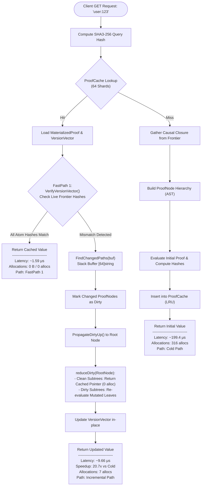
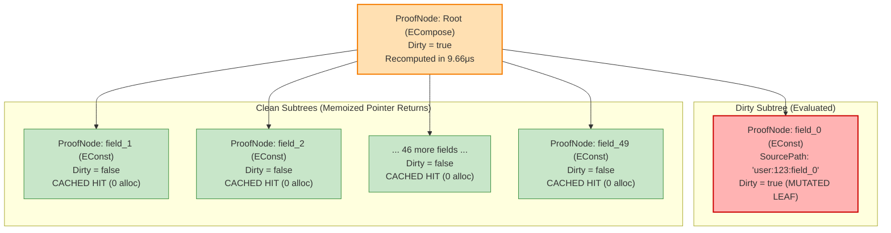
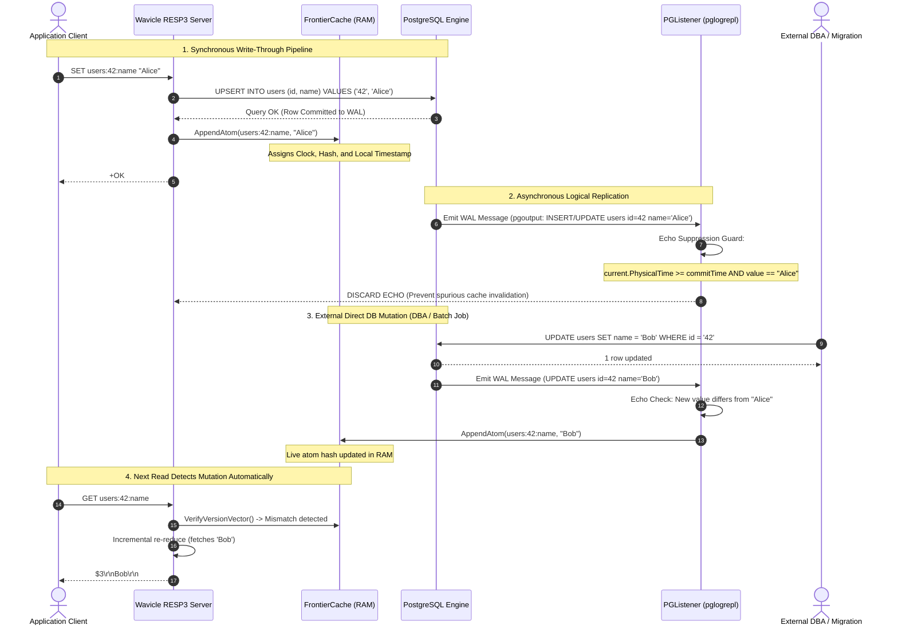
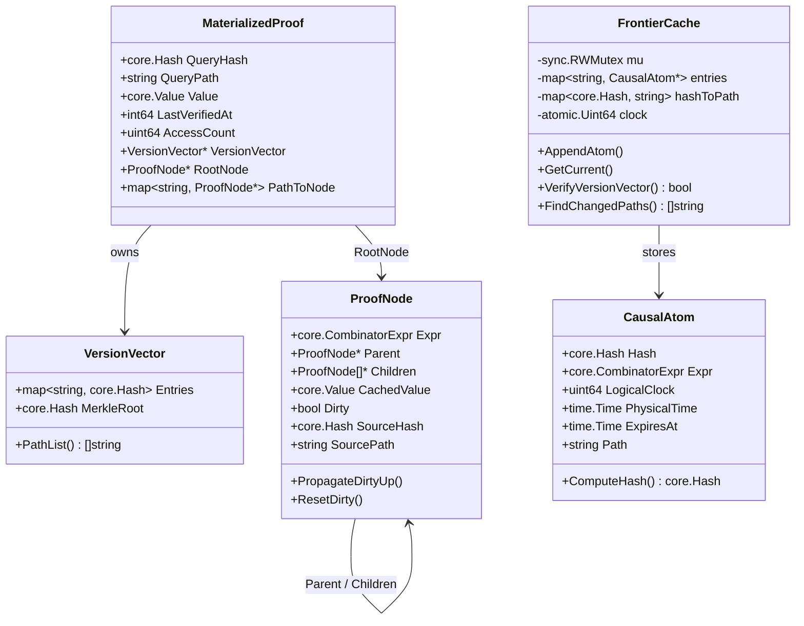

# Wavicle Architecture Diagrams & Visual Technical Specifications

> High-fidelity technical diagrams illustrating internal data flow, state machines, and memory layouts.

---

## 1. End-to-End Component Topology & Network Boundaries

```mermaid
flowchart TB
    subgraph Clients["Client Layer (Standard TCP / RESP3)"]
        C1["App Service 1 (Go / redigo)"]
        C2["App Service 2 (Node.js / ioredis)"]
        CLI["Admin CLI (wavicle-cli / redis-cli)"]
    end

    subgraph Wavicle["Wavicle Server Boundary"]
        subgraph NetLayer["Network & Protocol (internal/protocol/resp3)"]
            TCP["TCP Listener (:6379)"]
            Parser["RESP3 / Inline Frame Parser"]
            ConnLimit{"Active Conns < 10,000?"}
        end

        subgraph CoreEngine["Proof Reduction Engine (internal/engine)"]
            PCache[("ProofCache\n64 Shards / LRU")]
            Resolver["Frontier Resolver"]
            ASTEngine["AST Reducer (reduceDirty)"]
        end

        subgraph StorageLayer["In-Memory Storage (internal/storage)"]
            Frontier[("FrontierCache\nO(unique keys) in RAM")]
            TTLSweeper["TTL Sweeper\n(60s Ticker)"]
        end

        subgraph CDCLayer["Replication Consumer (internal/replication)"]
            CDCListener["PGListener (pglogrepl)"]
            EchoFilter{"Echo Suppression\nGuard"}
        end
    end

    subgraph Database["Persistent Database Layer"]
        PGPrimary[("PostgreSQL 15+ Primary")]
        PGSlot["Logical Replication Slot\n(pgoutput plugin)"]
    end

    C1 -->|TCP / Port 6379| TCP
    C2 -->|TCP / Port 6379| TCP
    CLI -->|TCP / Port 6379| TCP

    TCP --> ConnLimit
    ConnLimit -->|Accept| Parser
    Parser -->|Dispatch GET / HGET| CoreEngine
    Parser -->|Dispatch SET / HSET| StorageLayer

    CoreEngine <-->|Lookup / Update Proof| PCache
    CoreEngine <-->|Verify Version Vector| Frontier
    
    StorageLayer -->|Sync Write-Through| PGPrimary
    PGPrimary -.->|Write-Ahead Log (WAL)| PGSlot
    PGSlot -->|Stream Tuple Messages| CDCListener
    CDCListener --> EchoFilter
    EchoFilter -->|Pass External Writes| Frontier
    EchoFilter -.->|Discard Echoes| Drop[("Discard Echo")]
    TTLSweeper -->|Reclaim Expired| Frontier
```

---

## 2. Read Path Decision Flow & Latency Profiles



---

## 3. AST ProofNode Tree Dirty Propagation

When 1 field out of a 50-field composite object changes, dirty propagation isolates the mutation to the exact ancestor path, leaving the other 49 branches memoized:



---

## 4. Write-Through & CDC Replication Sequence



---

## 5. In-Memory Data Structure Memory Map


