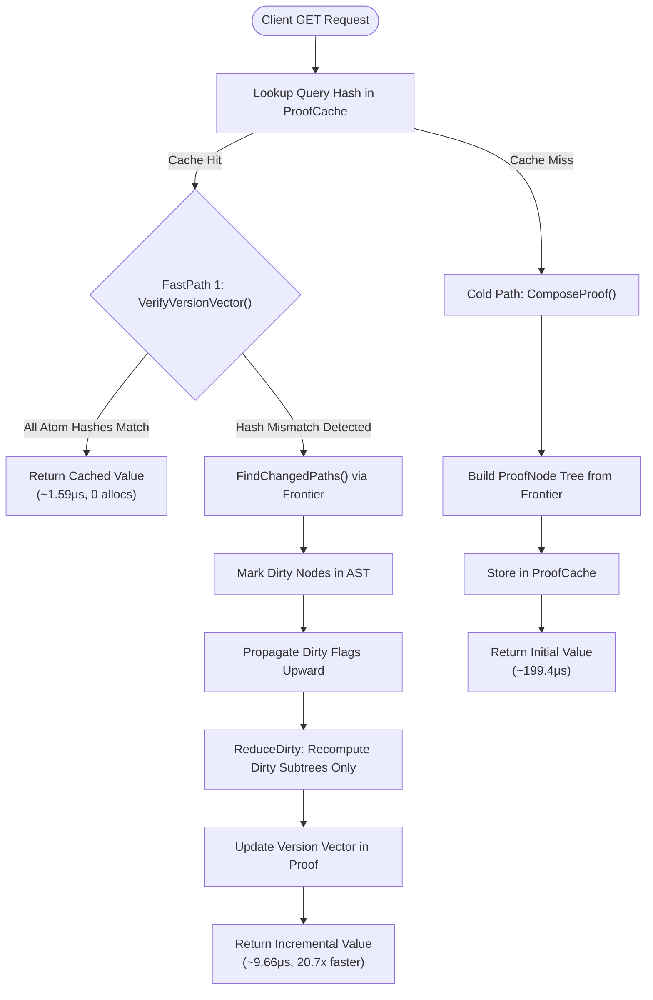
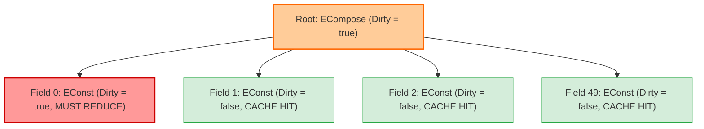
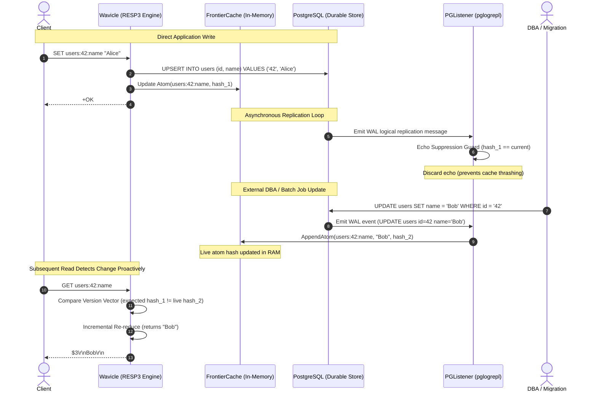
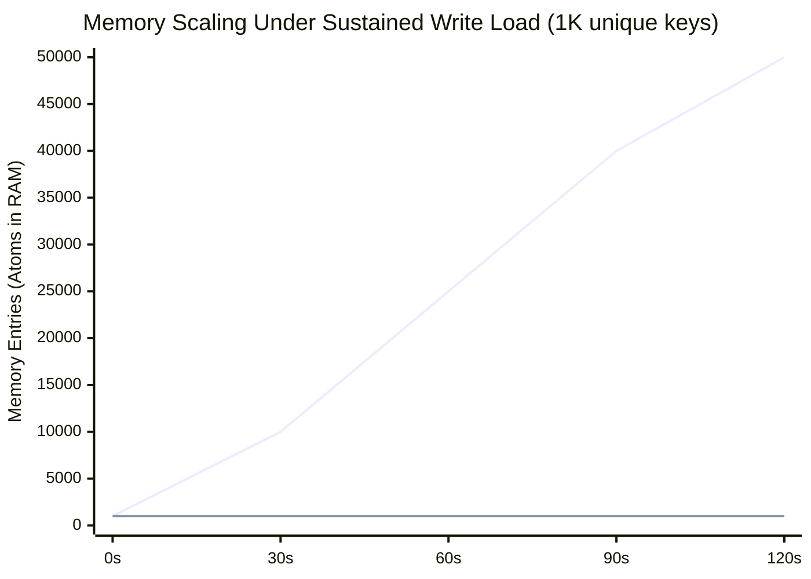

# Wavicle System Architecture & Flow Diagrams

> Visual technical reference for Wavicle's proof-based caching model.

---

## 1. End-to-End System Topology

```mermaid
graph TD
    subgraph Clients["Client Applications"]
        App1["App Instance 1 (Go / redis-go)"]
        App2["App Instance 2 (Node / ioredis)"]
        CLI["wavicle-cli / redis-cli"]
    end

    subgraph Wavicle["Wavicle Consistency Engine"]
        TCP["RESP3 TCP Server (:6379)"]
        Engine["Proof Reduction Engine"]
        PCache[("Sharded LRU ProofCache")]
        FCache[("FrontierCache (O(unique keys))")]
        CDC["PG Logical Replication Listener"]
    end

    subgraph Database["Primary Storage"]
        PG[("PostgreSQL 15+")]
        WAL["Postgres WAL / pglogrepl"]
    end

    App1 -->|TCP / RESP3| TCP
    App2 -->|TCP / RESP3| TCP
    CLI -->|TCP / RESP3| TCP

    TCP --> Engine
    Engine <-->|Check Receipt / Fetch Proof| PCache
    Engine <-->|Verify Hashes| FCache
    
    TCP -->|Write-Through (Sync)| PG
    PG -.->|Logical Changes (Async)| WAL
    WAL -->|Stream CDC Events| CDC
    CDC -->|Update Live Atoms| FCache
```

---

## 2. Read Execution Decision Flowchart



---

## 3. AST ProofNode Tree Dirty Invalidation

This diagram illustrates how mutating a single field (`field_0`) invalidates only its ancestor path, leaving the remaining 49 fields cached.



---

## 4. Write-Through & CDC Replication Sequence



---

## 5. Memory Footprint Comparison


*(Blue line: CausalCrystal full DAG $O(\text{writes})$; Orange line: FrontierCache $O(\text{unique keys})$ flat at 1,000 entries).*
