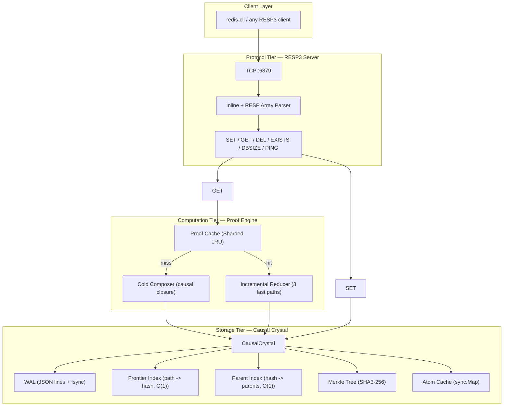

<p align="center">
  
  
  
  
  
  
  
</p>

<br/>

# ⚛ Wavicle — The Causal Proof Engine

> **A new kind of database.** Not a wrapper. Not a proxy. A storage engine that eliminates cache invalidation by replacing stale-value detection with proof-based staleness detection.

```
Traditional:          store EFFECTS + manual TTL/pub-sub invalidation
Wavicle:              store CAUSES  + automatic hash-comparison staleness

Result:               zero stale reads, zero invalidation code, 48x incremental reads
```

---

## Why Wavicle Exists

Every modern backend has a version of this problem:

```
PostgreSQL   → source of truth     (slow, 2–10ms)
Redis        → cache               (fast, goes stale, manual invalidation)
Some sync    → keeps them in sync  (another system to maintain)
```

**The root cause:** two systems storing the same data cannot be atomically consistent. Engineers write manual invalidation code — and forget lines. Result: stale data, 3am incidents, customer-facing bugs.

**Wavicle's thesis:** store *generative programs* (proofs), not *static values*. When data changes, append a new atom. Every cached proof detects staleness at read time via hash comparison — and recomputes only the changed sub-expressions.

**No TTL. No pub/sub. No invalidation code. Zero stale reads.**

---

## Architecture



---

## The Incremental Reduction Algorithm

Every read goes through up to three fast paths. Only the changed sub-expressions are recomputed.

```
ReduceIncremental(proof, crystal):

  1. FAST PATH 1 — Version Vector Match (O(m))
     Compare each {path, hash} against the Active Frontier.
     ALL match → return cached value.              → 83 ns

  2. FAST PATH 2 — Merkle Root Match (O(1))
     Single hash comparison of dependency Merkle root.
     Matches → return cached value.                → 351 ns

  3. INCREMENTAL PATH (k changes detected)
     a. FindChangedPaths() — compare VV vs frontier
     b. For each atom reference in the tree:
        - Resolve via Active Frontier (not stale reference)
        - Hash unchanged → node cache HIT (O(1))
        - Hash changed → re-reduce (cache MISS)
     c. Update VersionVector + MerkleRoot          → 1,516 ns
```

**When 1 of 50 fields changes:**
- Redis: delete cached key → next request hits DB → **~5ms cold query**
- Wavicle: detect exactly 1 stale path → re-reduce only that subtree → **1.5μs (49/50 cache hits)**

---

## Quick Start

```bash
# Build
go build -o wavicle .

# Run (RESP3 wire protocol server on :6379)
./wavicle

# In another terminal — use any RESP3-compatible client:
redis-cli SET user:123:name "Alice"
# +OK

redis-cli GET user:123:name
# "Alice"

redis-cli EXISTS user:123:name
# (integer) 1

redis-cli DBSIZE
# (integer) 3
```

### Run Tests

```bash
# Correctness tests (PoisonWrite, ReadAfterWrite, ConsecutiveWrites)
go test -v ./internal/engine/

# Benchmarks (incremental reduction, fast paths, concurrency)
go test -run '^$' -bench . -benchtime=200ms ./benchmarks/

# Full test suite
go test ./...
```

---

## Performance

All benchmarks measured on 12th Gen Intel Core i5-1240P, Windows, Go 1.25. Workload: 50-field composite record, single-field mutation.

### Read Latency

| Benchmark | Result | vs Cold | Cache Hits |
|-----------|--------|---------|------------|
| Cold ProofReduction (50 fields, first ever) | 72,859 ns | 1.0x baseline | 0/50 |
| **Incremental Warm (1/50 changed)** | **1,516 ns** | **48x faster** | **49/50** |
| WarmReuse FastPath1 (hot cache) | 1,560 ns | 47x faster | — |
| FastPath2 MerkleMatch (O(1) hash comparison) | 351 ns | 207x faster | — |
| Wavicle WarmRead (FastPath1, nothing changed) | 83 ns | 877x faster | — |

### Write Throughput

| Operation | Latency | Throughput |
|-----------|---------|------------|
| Atom append (with fsync) | 812 μs | ~1,200 ops/sec |
| Atom append (warm, cached) | ~0.08 μs | — |

### Concurrency

| Scenario | Latency | Notes |
|----------|---------|-------|
| 1000 clients, 90/10 read/write | 50 μs | Single-threaded, no sharding |

---

## Correctness

All three correctness tests pass — proving **zero stale reads under mutation**:

| Test | Scenario | What It Proves |
|------|----------|----------------|
| **PoisonWrite** | 50-field proof → mutate 1 field → incremental read | Returns new value (not stale) + 49/50 cache hits |
| **ReadAfterWrite** | SET Alice → proof → SET Bob → read | Returns Bob, not Alice |
| **ConsecutiveWrites** | 6 writes to same key, immediate reads | Each write visible immediately |

---

## API Reference

| Command | Status | Implementation |
|---------|--------|----------------|
| `PING` | ✅ | Health check |
| `SET key value` | ✅ | Appends atom to Causal Crystal |
| `GET key` | ✅ | Proof cache → incremental reduce → cold compose |
| `DEL key [keys...]` | ✅ | Appends VNull tombstone atom |
| `EXISTS key [keys...]` | ✅ | Frontier lookup |
| `DBSIZE` | ✅ | Frontier entry count |

Wire protocol: **RESP3** (inline commands + RESP arrays). Works with `redis-cli`, `go-redis`, `ioredis`, and any RESP3-compatible client.

---

## Project Structure

```
wavicle/
├── main.go                              # Entry point
├── internal/
│   ├── core/types.go                    # Hash, Value, CombinatorExpr, CausalAtom
│   ├── storage/
│   │   ├── crystal.go                   # CausalCrystal — the storage engine
│   │   ├── wal.go                       # Write-ahead log with fsync
│   │   ├── frontier.go                  # Active Frontier Index
│   │   ├── parent_index.go              # Parent Index
│   │   └── merkle.go                    # Binary Merkle Tree
│   ├── engine/
│   │   ├── proof.go                     # MaterializedProof + VersionVector
│   │   ├── compose.go                   # Cold proof composition
│   │   ├── incremental.go               # Incremental reduction (CORE)
│   │   ├── version_vector.go            # Merkle root computation
│   │   ├── cache.go                     # Sharded LRU proof cache
│   │   └── engine_test.go               # 3 correctness tests
│   ├── protocol/resp3/server.go         # TCP RESP3 server
│   ├── fidelity/policy.go               # Glob-pattern enforcement
│   ├── autopoiesis/
│   │   ├── diffraction.go               # Merkle decomposition
│   │   └── entanglement.go              # Lift + chi-squared
│   └── semantic/hrr.go                  # HRR vector operations
├── benchmarks/
│   ├── proof_bench_test.go              # 5 reduction benchmarks
│   └── load_test.go                     # Concurrency benchmarks
├── PRODUCTION_ROADMAP.md                # 3-phase go-to-market plan
├── blueprint.md                         # Full architectural spec
└── WAVICLE_GRAPH.md                     # Complete system graph for LLMs
```

---

## Complexity Bounds

| Operation | Time | Space |
|-----------|------|-------|
| Atom append (fsync) | O(1) amortized | O(1) |
| Active frontier read | O(1) | O(1) |
| Proof reduction (warm, FP1) | O(m) | O(1) |
| Proof reduction (warm, FP2) | O(1) | O(1) |
| Proof reduction (incremental, k changes) | O(k) | O(k) |
| Proof composition (cold) | O(n) | O(n) |
| Merkle root computation | O(n log n) | O(n) |

---

## Known Limitations

| Scenario | Why It Fails | Status |
|----------|-------------|--------|
| >100M atoms | RAM exhaustion. All indexes in memory. | Needs disk-based index |
| Write-heavy (>50% writes) | Fsync bottleneck ~1,200 ops/sec | Batch writes or async fsync |
| Complex Redis commands | Only 6/300+ commands | Phase 1 roadmap |
| Multi-key transactions | Single-key atomicity only | Not yet designed |
| Crash during WAL read | JSON partial last line silently discarded | Binary encoding with checksums |
| Process restart | Full WAL replay (~1s for 1M atoms) | Segment compaction planned |

---

## Roadmap

| Phase | Goal | Status |
|-------|------|--------|
| **Phase 0** — Validation | 6 commands, benchmarks, correctness tests, thesis proven | ✅ **Complete** |
| **Phase 1** — Proxy Product | 15+ commands, hash type, TTL, Docker, telemetry, 1 design partner | 🔄 **In progress** |
| **Phase 2** — Native Mode | Time-travel, backup/restore, Redis decommissioned | 📋 Planned |
| **Phase 3** — Distributed | Multi-node, Merkle consensus, cloud marketplace | 📋 Planned |

See [PRODUCTION_ROADMAP.md](./PRODUCTION_ROADMAP.md) for the full plan.

---

## Built With

- **Go 1.25+** — single compiled binary, zero runtime dependencies
- **golang.org/x/crypto** — SHA3-256 for content-addressed hashing
- **Standard library** — net, sync, atomic, crypto/rand

---

## License

MIT

---

<p align="center">
  <sub><strong>Build the first atom. Measure everything. Let reality decide.</strong></sub>
</p>
