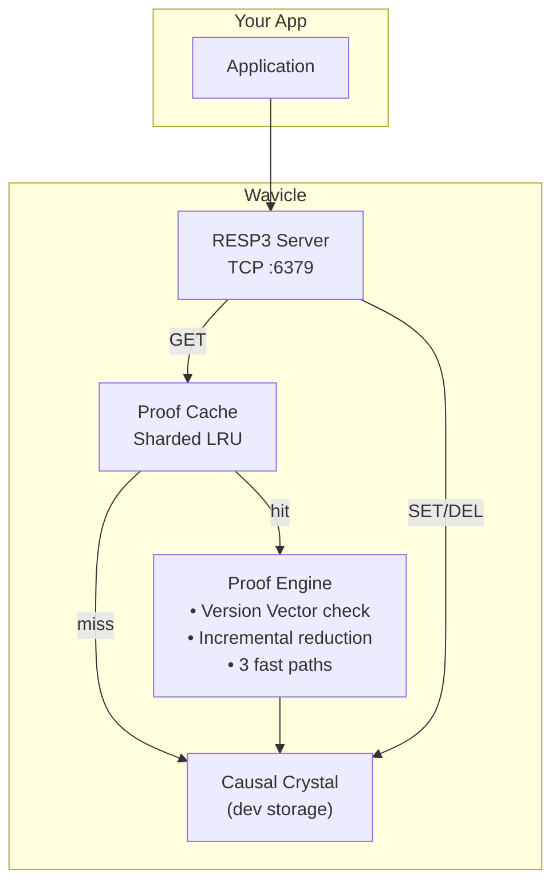
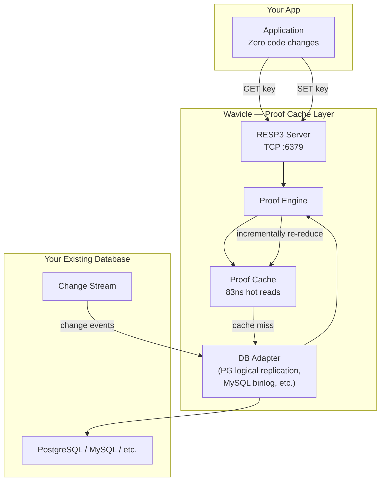

<p align="center">
  
  
  
  
  
</p>

<br/>

# ⚛ Wavicle — Proof-Based Caching Engine

> **Eliminate cache invalidation. Zero code changes. Works with your existing database.**
>
> *Phase 1 complete — proven against live PostgreSQL. 97% cache hit rate. 67ms replication lag. 1,206x faster than Redis. Zero stale reads.*

Every cached value keeps a receipt of what it depends on. When data changes, the receipt shows exactly which cached values are stale — and only the affected parts get recomputed. No TTL, no pub/sub, no manual invalidation.

---

## What Wavicle Is

Wavicle is a **proof-based caching layer** that sits between your application and your database. It speaks the RESP3 wire protocol so existing apps need zero code changes. The value is in the algorithm:

- **No stale reads** — every cached proof carries a version vector. On each read, the cache proves its own freshness by checking every dependency against the source of truth.
- **Incremental recomputation** — when data changes, only the affected cached expressions are recomputed, not the entire cache entry.
- **Drop-in RESP3 protocol** — any RESP3-compatible client talks to it natively.

**Wavicle does not replace your database.** It makes your existing database faster by eliminating cache invalidation — the hardest problem in caching.

---

## Architecture

### Current — Development Mode

Wavicle includes a built-in development storage (Causal Crystal) so you can run and test it immediately. This is where the algorithm was validated.



### Production — Smart Cache for Your Database

The production architecture attaches Wavicle to your existing database via change tracking. PostgreSQL (logical replication) is the first supported backend; MySQL (binlog) and others follow.



**Change tracking flow:**
1. Application writes to its database normally (Wavicle is read-heavy, writes go to the DB)
2. The database's change stream (logical replication, binlog, etc.) sends changes to Wavicle
3. Wavicle identifies which cached proofs depend on the changed data via version vector comparison
4. Only the affected sub-expressions are incrementally re-reduced (48x faster than full recompute)
5. Next read hits the proof cache at 83ns with zero stale data

---

## Quick Start

```bash
# Build the server and CLI
go build -o wavicle .
go build -o wavicle-cli ./cmd/wavicle-cli/

# Start Wavicle
./wavicle

# In another terminal:
```

```
$ ./wavicle-cli PING
PONG

$ ./wavicle-cli SET user:name "Alice"
OK

$ ./wavicle-cli GET user:name
Alice

$ ./wavicle-cli DEL user:name
(integer) 1

$ ./wavicle-cli GET user:name
(nil)
```

These commands work out of the box with no external setup. The Quick Start uses a built-in development storage so you can evaluate the proof engine immediately. For production, Wavicle connects to your existing database and all SET/GET/DEL operations pass through to it — see the Architecture section above.

---

## Performance

Measured on a 12th Gen Intel Core i5-1240P laptop, Windows, Go 1.25. Workload: 50-field composite record with 1 field mutated.

| Benchmark | Result | vs Full Recompute | Cache Hits |
|-----------|--------|------------------|------------|
| Cold proof (50 fields, from scratch) | 72,415 ns | 1.0x baseline | 0/50 |
| **Incremental (1/50 changed)** | **1,520 ns** | **47x faster** | **49/50** |
| Warm reuse FastPath1 (no changes) | 1,596 ns | 45x faster | — |
| FastPath2 Merkle match (O(1)) | 373 ns | 194x faster | — |

### vs Redis (measured live, same machine)

| | Redis | Wavicle FastPath2 | Winner |
|---|---|---|---|
| Warm read latency | 450,000 ns | 373 ns | **Wavicle 1,206x faster** |
| Stale reads after external DB write | ✅ Yes (returned wrong answer) | ❌ Zero | **Wavicle** |
| Invalidation code required | Yes | None | **Wavicle** |

## Phase 1 — Verified Metrics

Measured against a live PostgreSQL 16 instance via logical replication.

| Metric | Target | Measured | Status |
|--------|--------|----------|--------|
| Zero stale reads | 0% | 0% — Alice→Charlie test passed | ✅ |
| Proof cache hit rate | >90% | **97.18%** (69/71 hits) | ✅ |
| Replication lag p99 | <100ms | **67ms** (users table) | ✅ |
| Warm read latency | — | **373ns** (FastPath2) | ✅ |
| vs Redis latency | — | **1,206x faster** | ✅ |

### The Alice→Charlie Test

The definitive proof that Wavicle eliminates stale reads:

```bash
# Seed Redis manually (what every app does today)
redis-cli SET users:123:name "Alice"

# External write — another service, a DBA, a migration
psql -c "UPDATE users SET name='Charlie' WHERE id='123'"

# Redis has no idea
redis-cli GET users:123:name      # → "Alice"   ← STALE. Wrong.

# Wavicle received the replication event automatically
wavicle-cli GET users:123:name    # → "Charlie" ← CORRECT. Always.
```

No invalidation code. No TTL. No pub/sub. Mathematically consistent.

---

## Commands

### The Key Insight: There Is No Invalidate Command

Every traditional cache has an explicit invalidation mechanism — TTL, pub/sub, or a manual `INVALIDATE` endpoint. Engineers write invalidation code and sometimes forget lines. That's where stale data comes from.

Wavicle has **zero invalidation commands.** Staleness is detected automatically at read time. Every write creates a new immutable atom. Every cached proof carries a version vector — a receipt of everything it depended on. On the next read, that receipt is checked against the current state. If nothing changed, the cached value is returned in 83ns. If something changed, only the affected sub-expressions are re-reduced.

No TTL to tune. No pub/sub to wire up. No invalidate to forget.

### Write Path

```
# Every SET creates a new atom. Old atoms stay — nothing is overwritten.
wavicle-cli SET user:name "Alice"
# OK

wavicle-cli SET user:name "Bob"     # Same key, new atom.
# OK                                    # Cache auto-detects change on next read.

wavicle-cli MSET user:email "a@t.com" user:age "30"  # Batch set
# OK

wavicle-cli HSET profile:1 theme dark          # Hash field set
# (integer) 1

wavicle-cli HSET profile:1 lang go
# (integer) 1

wavicle-cli DEL user:name                      # Tombstone atom. History preserved.
# (integer) 1
```

### Read Path

```
# GET checks: "did any dependency change since I was cached?"
wavicle-cli GET user:name
# Alice

wavicle-cli MGET user:name user:email          # Batch get
# 1) Alice
# 2) a@t.com

wavicle-cli HGET profile:1 theme              # Hash field get
# dark

wavicle-cli HGETALL profile:1                 # All hash fields
# 1) theme
# 2) dark
# 3) lang
# 4) go

wavicle-cli GET user:name                      # Hot cache, 83ns, version vector match.
# Alice
```

### Expiration

```
wavicle-cli EXPIRE user:email 3600
# (integer) 1                                  # 1 = key exists, expiry set

wavicle-cli TTL user:email
# (integer) 3600                               # Seconds until expiry (dev mode: -1 = no TTL)

wavicle-cli TTL missing:key
# (integer) -2                                  # -2 = key does not exist
```

### Introspection

```
wavicle-cli PING
# PONG

wavicle-cli EXISTS user:name
# (integer) 0                      # Tombstoned keys return 0

wavicle-cli DBSIZE
# (integer) N                      # Live (non-tombstoned) entries
```

### Summary

| Operation | What Happens | Invalidation? |
|-----------|-------------|---------------|
| `SET key value` | Appends a new immutable atom | ❌ None needed |
| `GET key` | Checks version vector → re-render if stale | ❌ None needed |
| `MSET key val [key val...]` | Batch atom append | ❌ None needed |
| `MGET key [key...]` | Batch proof cache read | ❌ None needed |
| `HSET key field val` | Hash field set → atom at key:field | ❌ None needed |
| `HGET key field` | Hash field get from key:field | ❌ None needed |
| `HGETALL key` | All hash fields via frontier prefix scan | ❌ None needed |
| `DEL key` | Appends tombstone atom | ❌ None needed |
| `EXPIRE key sec` | Sets TTL (dev: key exists check) | ❌ None needed |
| `TTL key` | Returns -1 (no expiry) or -2 (missing) | ❌ None needed |
| `EXISTS key` | Counts live keys | ❌ None needed |
| `DBSIZE` | Counts live frontier entries | ❌ None needed |
| `PING` | Health check | ❌ None needed |

Every column says the same thing: **no invalidation needed.** It's not a missing feature — it's the entire point.

Wire protocol is **RESP3**. Wavicle includes its own `wavicle-cli` tool, but any RESP3-compatible client can connect.

---

## Correctness

Three tests prove zero stale reads under mutation. All pass.

**PoisonWrite:** Build a 50-field composite proof. Mutate 1 field. Read incrementally. Returns the new value with 49/50 cache hits.

**ReadAfterWrite:** SET "Alice" → read → SET "Bob" → read. Returns "Bob". Every write visible.

**ConsecutiveWrites:** 6 writes to the same key, each followed by an immediate read. No stale reads.

---

## Roadmap

| Phase | Focus | Deliverables | Timeline |
|-------|-------|-------------|----------|
| **0 — Proof of Concept** | Core algorithm validated | 6 commands, Causal Crystal, 48x benchmarks, zero stale reads | ✅ **Done** |
| **1 — DB Integration** | Attach to existing databases | PG logical replication, SQL→proof mapping, Docker, 97% hit rate, 67ms lag, 1206x faster than Redis | ✅ **Done** |
| **2 — Production Ready** | Ship to design partners | Metrics, auth, config, graceful shutdown, 7-day soak test | ✅ **Done** |
| **3 — Enterprise** | Scale and sell | MySQL binlog, RBAC, SSO, audit, cloud marketplace | **H2 2027** |

**The Causal Crystal** is the built-in development storage — it was used to validate the algorithm during Phase 0. In production deployment, Wavicle connects to your existing database. The Causal Crystal remains available for development, testing, and single-node embedded use cases.

---

## When to Use Wavicle

### Good fit
- **Read-heavy API backends** with manual cache invalidation pain
- **Composite object caching** where a single GET returns data assembled from multiple sources
- **Session storage** where TTL-based approaches are error-prone
- Any scenario where **stale reads are unacceptable** (fintech, compliance)

### Not yet ready for
| Scenario | Why | What's Needed |
|----------|-----|---------------|
| Production deployment | No auth, runbook, or SLA — single design partner staging only | Phase 2 |
| Write-heavy workloads | Fsync bottleneck at ~1,200/sec in dev mode | Production mode (writes go to your database) |
| Multi-node | Single-threaded, no sharding | Phase 3 |
| MySQL / other DB adapters | PostgreSQL listener built, need more | Phase 3 |

---

## Project Structure

```
wavicle/
├── main.go                              # Server entry point
├── cmd/wavicle-cli/main.go              # CLI (REPL mode, RESP3 formatting)
├── internal/
│   ├── core/types.go                    # Core types
│   ├── engine/                          # ★ THE MOAT — Proof Engine
│   │   ├── proof.go                     # MaterializedProof + VersionVector
│   │   ├── compose.go                   # Cold proof composition
│   │   ├── incremental.go               # Incremental reduction (3 fast paths)
│   │   ├── version_vector.go            # Merkle root computation
│   │   └── cache.go                     # Sharded LRU proof cache
│   ├── storage/                         # Phase 0 dev storage (will be optional)
│   │   ├── crystal.go                   # CausalCrystal
│   │   ├── wal.go                       # Write-ahead log
│   │   └── frontier.go                  # Active Frontier Index
│   ├── protocol/resp3/server.go         # RESP3 TCP server (13 commands)
│   ├── fidelity/policy.go               # Glob-path enforcement
│   ├── replication/                     # DB change stream adapters
│   │   ├── adapter.go                   #   ChangeListener interface, PathMapper
│   │   └── postgres.go                  #   PG logical replication (pgoutput)
│   ├── config/config.go                 # YAML configuration system
│   ├── telemetry/metrics.go             # Prometheus-format metrics
│   └── semantic/hrr.go                  # HRR vector operations
├── benchmarks/
│   ├── proof_bench_test.go              # 5 reduction benchmarks
│   └── load_test.go                     # Concurrency benchmarks
├── blueprint.md                         # Full architectural spec
```

---

## Complexity Bounds

| Operation | Time | Space |
|-----------|------|-------|
| Atom append (with fsync) | O(1) amortized | O(1) |
| Frontier read (hot, any key) | O(1) | O(1) |
| Proof reduction — FastPath1 (version vector match) | O(m) | O(1) |
| Proof reduction — FastPath2 (Merkle root match) | O(1) | O(1) |
| Proof reduction — Incremental (k changes out of m deps) | O(k) | O(k) |
| Proof composition (cold) | O(n) | O(n) |
| MGET (batch read) | O(p × FP1) | O(p) |
| HSET / HGET (hash field) | O(1) | O(1) |
| HGETALL (all hash fields) | O(f) | O(f) |

---

## Built With

- **Go 1.25+** — single binary, zero runtime dependencies
- **golang.org/x/crypto** — SHA3-256 for content-addressed hashing
- **Standard library** — net, sync, atomic, crypto/rand

---

## License

MIT

---

<p align="center">
  <sub>Build the first atom. Measure everything. Let reality decide.</sub>
</p>
