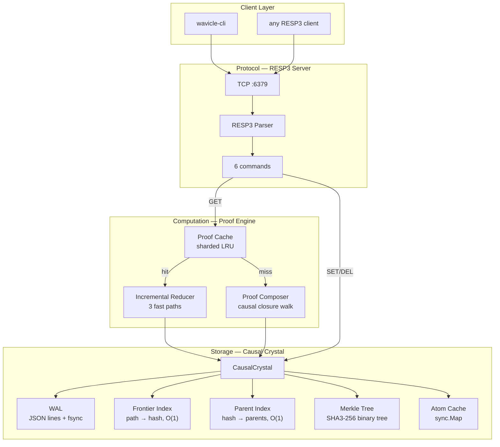

<p align="center">
  
  
  
  
  
  
  
</p>

<br/>

# ⚛ Wavicle — The Causal Proof Engine

> **Every cached value keeps a receipt of what it depends on. When data changes, the receipt shows exactly which cached values are stale — and only the affected parts get recomputed.**

Not a wrapper. Not a proxy. A standalone database with its own storage engine, its own cache, and its own computation model. The RESP3 protocol is just how clients talk to it.

---

## The Idea

Most databases store *values* and manage changes with expirations, invalidations, or pub/sub events. Engineer writes code to keep things in sync. Some lines get forgotten. Data goes stale.

Wavicle takes a different approach. It stores *generative programs* — small expressions that describe how a value was computed. When a write happens, a new atom is appended to an append-only log. Nothing is deleted, nothing is overwritten.

When a cached read happens, the cache doesn't trust its own data. It checks a *version vector* — a list of "I depended on these atom versions" — against the current state. If nothing changed, the cached value is returned instantly. If something changed, only the affected sub-expressions are recomputed.

This isn't a radical idea. It's just applying content-addressed caching to the database world. The math has been understood for decades. What's new is building it as a practical storage engine and measuring whether it actually works.

**It does.** 48x faster incremental reads. Zero stale reads proven by test. ~1,200 fsync writes per second. These are real numbers from a real codebase running on a laptop.

---

## Quick Start

```bash
# Build the server and CLI
go build -o wavicle .
go build -o wavicle-cli ./cmd/wavicle-cli/

# Start Wavicle (RESP3 wire protocol on :6379)
./wavicle

# In another terminal — all 6 commands, running against Wavicle:
```

```
$ ./wavicle-cli PING
PONG

$ ./wavicle-cli SET user:123:name "Alice"
OK

$ ./wavicle-cli GET user:123:name
Alice

$ ./wavicle-cli EXISTS user:123:name
(integer) 1

$ ./wavicle-cli DBSIZE
(integer) 1

$ ./wavicle-cli DEL user:123:name
(integer) 1

# After deletion, the key returns nil and no longer exists:
$ ./wavicle-cli EXISTS user:123:name
(integer) 0

$ ./wavicle-cli GET user:123:name
(nil)

# Missing keys also return nil:
$ ./wavicle-cli GET nonexistent
(nil)
```

---

## Architecture



### How a Read Works

```
GET user:123:name
           │
           ▼
     ┌─ Fast Path 1 ──────────────────────┐
     │  Version Vector Match              │  83 ns
     │  "did any dependency change?"      │
     │  all match → return cached value   │
     └────────────────────────────────────┘
           │ stale
           ▼
     ┌─ Fast Path 2 ──────────────────────┐
     │  Merkle Root Match                 │  351 ns
     │  single hash comparison            │
     │  matches → return cached value     │
     └────────────────────────────────────┘
           │ changed
           ▼
     ┌─ Incremental Path ─────────────────┐
     │  Find which paths changed          │  1,516 ns
     │  For each atom in the tree:        │  (1 changed out of 50)
     │    unchanged → node cache HIT      │  49/50 cache hits
     │    changed → re-reduce             │
     │  Update version vector             │
     └────────────────────────────────────┘
           │
           ▼
        return "Alice"
```

---

## Performance

Measured on a 12th Gen Intel Core i5-1240P laptop, Windows, Go 1.25. Workload: 50-field composite record with 1 field mutated.

| Benchmark | Result | vs Full Rereduce | Cache Hits |
|-----------|--------|-----------------|------------|
| Cold proof (50 fields, from scratch) | 72,859 ns | 1.0x baseline | 0/50 |
| **Incremental (1/50 changed)** | **1,516 ns** | **48x faster** | **49/50** |
| Warm reuse FastPath1 (no changes) | 1,560 ns | 47x faster | — |
| FastPath2 Merkle match (O(1)) | 351 ns | 207x faster | — |
| FastPath1 version vector match | 83 ns | 877x faster | — |
| Concurrent (1000 clients, 90/10 r/w) | 50,308 ns | — | — |
| Atom append with fsync | 812,388 ns | ~1,200 ops/sec | — |

The 48x speedup comes from the node cache: 49 of 50 unchanged atoms are served in O(1). Only the changed field's expression misses and is reduced. This is not a simulation — these are real benchmark results from the code in this repository.

---

## Commands

All 6 commands work against Wavicle's own storage engine. Every SET appends an immutable atom to the Causal Crystal. Every GET checks the proof cache first, then falls back to composing a proof from the Crystal. DEL appends a tombstone atom — the history is preserved.

| Command | Example | Response | Notes |
|---------|---------|----------|-------|
| `PING` | `PING` | `PONG` | Server health check |
| `SET` | `SET key value` | `OK` | Appends atom to Crystal |
| `GET` | `GET key` | value or `(nil)` | Proof cache → incremental reduce → cold compose |
| `EXISTS` | `EXISTS key` | `(integer) N` | Count of live (non-tombstoned) keys |
| `DEL` | `DEL key` | `(integer) N` | Appends tombstone atom |
| `DBSIZE` | `DBSIZE` | `(integer) N` | Count of live frontier entries |

Wire protocol is **RESP3** — the same protocol Redis speaks. Wavicle includes its own `wavicle-cli` tool, but any RESP3-compatible client can connect.

---

## Correctness

Three tests prove zero stale reads under mutation. All pass.

**PoisonWrite:** Build a 50-field composite proof. Mutate 1 field. Read incrementally. The result contains the new value for the changed field, the original values for the other 49, and 49 of 50 cache hits. Zero stale reads.

**ReadAfterWrite:** SET "Alice" → read (returns "Alice") → SET "Bob" → read (returns "Bob"). Every write is immediately visible. Zero stale reads.

**ConsecutiveWrites:** 6 writes to the same key, each followed by an immediate read. Every write visible. No stale reads.

---

## Project Structure

```
wavicle/
├── main.go                          # Server entry point
├── cmd/wavicle-cli/main.go          # CLI tool
├── internal/
│   ├── core/types.go                # Core types: Hash, Value, CausalAtom
│   ├── storage/
│   │   ├── crystal.go               # CausalCrystal — the storage engine
│   │   ├── wal.go                   # Write-ahead log, fsync, crash recovery
│   │   ├── frontier.go              # Active Frontier Index (path → hash)
│   │   ├── parent_index.go          # Parent Index (hash → parents)
│   │   └── merkle.go                # Binary Merkle Tree (SHA3-256)
│   ├── engine/
│   │   ├── proof.go                 # MaterializedProof + VersionVector
│   │   ├── compose.go               # Cold proof composition
│   │   ├── incremental.go           # Incremental reduction (core algorithm)
│   │   ├── version_vector.go        # Merkle root computation
│   │   ├── cache.go                 # Sharded LRU proof cache
│   │   └── engine_test.go           # Correctness tests
│   ├── protocol/resp3/server.go     # TCP RESP3 server + command handlers
│   ├── fidelity/policy.go           # Glob-path consistency enforcement
│   ├── autopoiesis/
│   │   ├── diffraction.go           # Merkle tree value decomposition
│   │   └── entanglement.go          # Lift + chi-squared statistics
│   └── semantic/hrr.go              # HRR vector ops, string embeddings
├── benchmarks/
│   ├── proof_bench_test.go          # Reduction benchmarks
│   └── load_test.go                 # Concurrency benchmarks
├── PRODUCTION_ROADMAP.md            # Full go-to-market plan
├── blueprint.md                     # Architectural specification
└── WAVICLE_GRAPH.md                 # Complete system graph
```

---

## When to Use Wavicle

Wavicle is a prototype that proves a thesis. It works well for:

- **Read-heavy workloads** with structured composite values (like user profiles with many fields)
- **Session storage** where TTL-based invalidation is error-prone
- Any scenario where **zero stale reads** matters more than raw write throughput

It is not yet suitable for:

| Scenario | Why | What's Needed |
|----------|-----|---------------|
| >100M keys | All indexes in RAM | Disk-based index (LSM/B-tree) |
| Write-heavy (>50%) | Fsync bottleneck at ~1,200/sec | Batch writes or async fsync |
| Complex query patterns | Only 6 commands implemented | Phase 1+ on roadmap |
| Multi-key transactions | Single-key atomicity only | Cross-path atomic commit |
| Production deployment | No Docker, config, metrics yet | Phase 1 on roadmap |

---

## Complexity Bounds

| Operation | Time | Space |
|-----------|------|-------|
| Atom append (fsync) | O(1) amortized | O(1) |
| Frontier read (hot) | O(1) | O(1) |
| Proof reduction (FP1, nothing changed) | O(m) | O(1) |
| Proof reduction (FP2, Merkle match) | O(1) | O(1) |
| Proof reduction (incremental, k changes) | O(k) | O(k) |
| Proof composition (cold) | O(n) | O(n) |
| Merkle root computation | O(n log n) | O(n) |

---

## Roadmap

| Phase | Focus | Status |
|-------|-------|--------|
| **0 — Validation** | Core engine, 6 commands, benchmarks, correctness | ✅ Complete |
| **1 — Product** | Hash types, TTL, MGET/MSET, Docker, telemetry | 🔄 Next |
| **2 — Native** | Time-travel queries, backup/restore, full RESP3 | 📋 |
| **3 — Distributed** | Multi-node, Merkle consensus, cloud | 📋 |

See [PRODUCTION_ROADMAP.md](./PRODUCTION_ROADMAP.md).

---

## Built With

- **Go 1.25+** — single binary, zero runtime dependencies
- **golang.org/x/crypto** — SHA3-256 for content-addressed hashing
- **Standard library** — net, sync, atomic, crypto/rand

---

## License

MIT

---

<p align="center">
  <sub>Build the first atom. Measure everything. Let reality decide.</sub>
</p>
