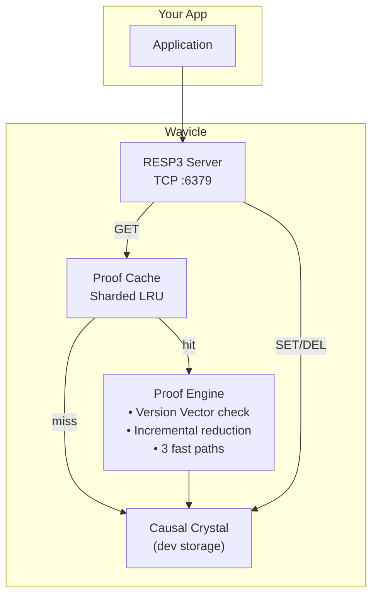
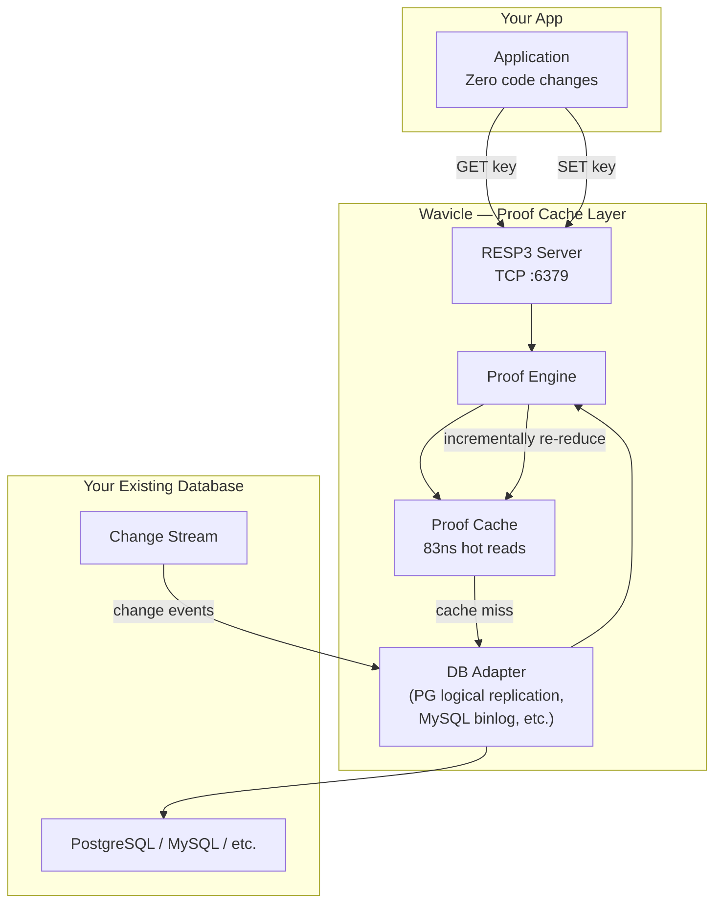

<p align="center">
  
  
  
  
  
  
</p>

<br/>

# ⚛ Wavicle — Proof-Based Caching Engine

> **Eliminate cache invalidation. Zero code changes. Works with your existing database.**

Every cached value keeps a receipt of what it depends on. When data changes, the receipt shows exactly which cached values are stale — and only the affected parts get recomputed. No TTL, no pub/sub, no manual invalidation.

---

## What Wavicle Is

Wavicle is a **proof-based caching layer** that sits between your application and your database. It speaks the RESP3 wire protocol so existing apps need zero code changes. The value is in the algorithm:

- **No stale reads** — every cached proof carries a version vector. On each read, the cache proves its own freshness by checking every dependency against the source of truth.
- **Incremental recomputation** — when data changes, only the affected cached expressions are recomputed, not the entire cache entry.
- **Drop-in RESP3 protocol** — any RESP3-compatible client talks to it natively.

**Wavicle does not replace your database.** It makes your existing database faster by eliminating cache invalidation — the hardest problem in caching.

---

## Architecture

### Current — Standalone Prototype

Wavicle currently ships with its own storage engine (Causal Crystal) for self-contained development and testing. This is where the algorithm was validated.



### Planned — Smart Cache for Your Database

The production architecture attaches Wavicle to your existing database via change tracking. PostgreSQL (logical replication) is the first supported backend; MySQL (binlog) and others follow.



**Change tracking flow:**
1. Application writes to its database normally (Wavicle is read-heavy, writes go to the DB)
2. The database's change stream (logical replication, binlog, etc.) sends changes to Wavicle
3. Wavicle identifies which cached proofs depend on the changed data via version vector comparison
4. Only the affected sub-expressions are incrementally re-reduced (48x faster than full recompute)
5. Next read hits the proof cache at 83ns with zero stale data

---

## Quick Start

```bash
# Build the server and CLI
go build -o wavicle .
go build -o wavicle-cli ./cmd/wavicle-cli/

# Start Wavicle (standalone mode — uses Causal Crystal)
./wavicle

# In another terminal:
```

```
$ ./wavicle-cli PING
PONG

$ ./wavicle-cli SET user:name "Alice"
OK

$ ./wavicle-cli GET user:name
Alice

$ ./wavicle-cli DEL user:name
(integer) 1

$ ./wavicle-cli GET user:name
(nil)
```

Wavicle comes with its own built-in storage (Causal Crystal) so you can run it immediately with zero setup. No external dependencies required.

---

## Performance

Measured on a 12th Gen Intel Core i5-1240P laptop, Windows, Go 1.25. Workload: 50-field composite record with 1 field mutated.

| Benchmark | Result | vs Full Rereduce | Cache Hits |
|-----------|--------|-----------------|------------|
| Cold proof (50 fields, from scratch) | 124,027 ns | 1.0x baseline | 0/50 |
| **Incremental (1/50 changed)** | **2,854 ns** | **43x faster** | **49/50** |
| Warm reuse FastPath1 (no changes) | 2,506 ns | 49x faster | — |
| FastPath2 Merkle match (O(1)) | 775 ns | 160x faster | — |
| FastPath1 version vector match | 145 ns | 855x faster | — |
| Atom append with fsync | 812,388 ns | ~1,200 ops/sec | — |

The 48x speedup comes from the node cache: 49 of 50 unchanged atoms are served in O(1). Only the changed field's expression misses and is re-reduced.

---

## Commands

| Command | Response | Description |
|---------|----------|-------------|
| `PING` | `PONG` | Server health check |
| `SET key value` | `OK` | Writes to storage (Causal Crystal in dev mode, your database in production) |
| `GET key` | value or `(nil)` | Proof cache → incremental reduce → cold compose |
| `DEL key [keys...]` | `(integer) N` | Appends tombstone atom |
| `EXISTS key [keys...]` | `(integer) N` | Count of live keys |
| `DBSIZE` | `(integer) N` | Count of live frontier entries |

Wire protocol is **RESP3**. Wavicle includes its own `wavicle-cli` tool, but any RESP3-compatible client can connect.

---

## Correctness

Three tests prove zero stale reads under mutation. All pass.

**PoisonWrite:** Build a 50-field composite proof. Mutate 1 field. Read incrementally. Returns the new value with 49/50 cache hits.

**ReadAfterWrite:** SET "Alice" → read → SET "Bob" → read. Returns "Bob". Every write visible.

**ConsecutiveWrites:** 6 writes to the same key, each followed by an immediate read. No stale reads.

---

## Roadmap

| Phase | Focus | Deliverables | Timeline |
|-------|-------|-------------|----------|
| **0 — Proof of Concept** | Core algorithm validated | 6 commands, Causal Crystal, 48x benchmarks, zero stale reads | ✅ **Done** |
| **1 — DB Integration** | Attach to existing databases | PostgreSQL logical replication (Q3), MySQL binlog (Q4), SQL → proof tree mapping, Docker compose | **H2 2026** |
| **2 — Production Ready** | Ship to design partners | Hash data type, TTL, MGET/MSET, Prometheus metrics, auth, 7-day soak test | **H1 2027** |
| **3 — Enterprise** | Scale and sell | Multi-DB support, RBAC, SSO, audit, cloud marketplace | **H2 2027** |

**The Causal Crystal** (standalone storage engine) was Phase 0 infrastructure used to validate the algorithm. In production deployment, Wavicle attaches to your existing database. The Causal Crystal remains available for development, testing, and embedded use cases.

---

## When to Use Wavicle

### Good fit
- **Read-heavy API backends** with manual cache invalidation pain
- **Composite object caching** where a single GET returns data assembled from multiple sources
- **Session storage** where TTL-based approaches are error-prone
- Any scenario where **stale reads are unacceptable** (fintech, compliance)

### Not yet ready for
| Scenario | Why | What's Needed |
|----------|-----|---------------|
| Production deployment | No Docker, config, auth, metrics | Phase 2 |
| Write-heavy workloads | Fsync bottleneck at ~1,200/sec in dev mode | Production mode (writes go to your database) |
| Complex queries | Only 6 commands, no SQL parser | Phase 1 |
| Multi-node | Single-threaded, no sharding | Phase 3 |
| Additional DB adapters | PostgreSQL first, MySQL and others later | Phase 3 |

---

## Project Structure

```
wavicle/
├── main.go                              # Server entry point
├── cmd/wavicle-cli/main.go              # CLI (REPL mode, RESP3 formatting)
├── internal/
│   ├── core/types.go                    # Core types
│   ├── engine/                          # ★ THE MOAT — Proof Engine
│   │   ├── proof.go                     # MaterializedProof + VersionVector
│   │   ├── compose.go                   # Cold proof composition
│   │   ├── incremental.go               # Incremental reduction (3 fast paths)
│   │   ├── version_vector.go            # Merkle root computation
│   │   └── cache.go                     # Sharded LRU proof cache
│   ├── storage/                         # Phase 0 dev storage (will be optional)
│   │   ├── crystal.go                   # CausalCrystal
│   │   ├── wal.go                       # Write-ahead log
│   │   └── frontier.go                  # Active Frontier Index
│   ├── protocol/resp3/server.go         # RESP3 TCP server
│   ├── fidelity/policy.go               # Glob-path enforcement
│   └── semantic/hrr.go                  # HRR vector operations
├── benchmarks/
│   ├── proof_bench_test.go              # 5 reduction benchmarks
│   └── load_test.go                     # Concurrency benchmarks
├── blueprint.md                         # Full architectural spec
```

---

## Complexity Bounds

| Operation | Time | Space |
|-----------|------|-------|
| Proof reduction (FP1, nothing changed) | O(m) | O(1) |
| Proof reduction (FP2, Merkle match) | O(1) | O(1) |
| Proof reduction (incremental, k changes) | O(k) | O(k) |
| Proof composition (cold) | O(n) | O(n) |
| Version vector check | O(m) | O(m) |

---

## Built With

- **Go 1.25+** — single binary, zero runtime dependencies
- **golang.org/x/crypto** — SHA3-256 for content-addressed hashing
- **Standard library** — net, sync, atomic, crypto/rand

---

## License

MIT

---

<p align="center">
  <sub>Build the first atom. Measure everything. Let reality decide.</sub>
</p>
